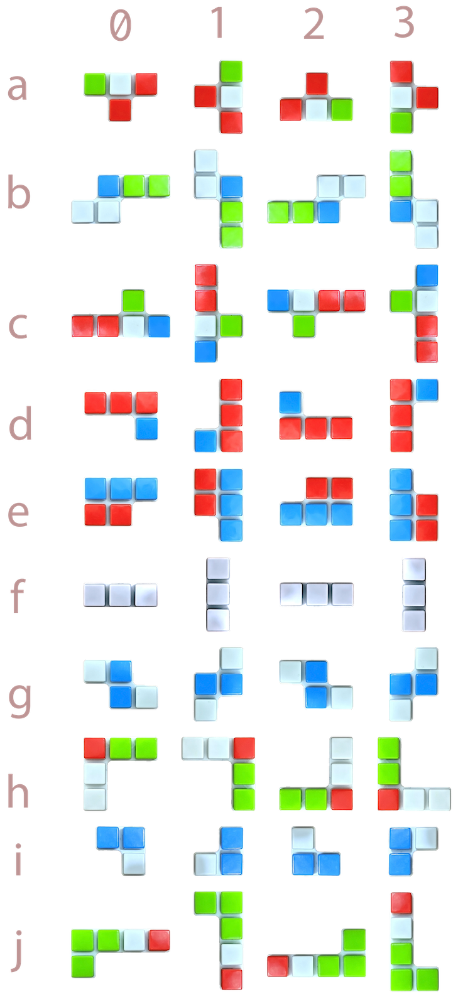

# Assignment Two Feedback

WARNING: REPO IS NOT UP TO DATE.

## Group  tue16i
u6730788 Zhongxuan Liu
u6744849 Anbang Li

## Tutor Comment

Amazing work team! Good job on completing the tasks and demonstrating an interesting UI design of the game!

For the GUI, I love how you made your piece and board. It's so cool!  Hopefully, in the future, you could improve the algorithm on constructing challenges to make the game run faster. Another thing is the hint is not very visible to users, which piece to put. Please clean your code. :D

For the backend, each class is self-explanatory. I like how you have enums and Tile and Piece class, but I was confused about TileType. It doesn't seem connected to anything. Not only that, most of the classes are missing the authorship. Methods naming are self-explanatory but some are not following java convention, and there are repetitive coding in some. More helper functions were created, have you tried testing them? Or the previous test could have been improved to test the functionality.

Overall, great teamwork on completing this assignment! Best of luck with your final exams!

## Mark

**  9.6/11.0**

## Miscellaneous marks

| Level | Requirement | Result |
|:-:|---|:-:|
||All files correct                     | .25/.25 |
||Authorship clear for all classes      | .1/.25 |
||Program runs from JAR                 | .25/.25 |
||Appropriate use of Git                | .35/.5  |
|P|Appropriate use of OO features       | .35/.5  |
|P|Presentation PDF complete            | .35/.5  |
|CR|Program well designed               | .25/.25 |
|CR|Comments clear and sufficient       | .25/.25 |
|CR|Coding style good                   | .25/.25 |
|CR|Appropriate use of JUnit tests      | 0/.25 |
|D|Design and code of very high quality | .25/.5  |
|D|Demonstrates interesting extensions  | .5/.75 |
|D|Works well and easy to run           | .15/.25 |
|HD|Game is exceptional                 | 1.0/1.0 |

**Total for miscellaneous marks:**  4.3/5.75

## Game marks (manual)

| Level | Requirement | Result |
|:-:|---|:-:|
|CR|Tiles snap into place (7)        | .25/.25 |
|CR|Tiles can be rotated (7)         | .25/.25 |
|CR|Only valid placements allowed (7)| .25/.25 |
|CR|Simple challenges (8)            | .25/.25 |
|D |Hints provided to player (10)    | .25/.25 |
|HD|Interesting challenges (11)      | .5/.5  |

**Total for manual marks:** 1.75/1.75

## Test results

```
Test Name   Tests Passed  Weighting    Score
-----              -----      -----    -----
task2                5/5        0.5      0.5
task3                4/4        0.5      0.5
task5                5/5       0.75     0.75
task6                4/4       1.25     1.25
task9                5/5        0.5      0.5
-----              -----     Total:  3.5/3.5
```
## Originality statements

#### Originality statement G
# IMPORTANT: It is very important that you correctly complete this originality
# statement.
#
# This is your statement of your submitted work being your own.
# Incorrectly filling out this statement could lead to charges
# of academic misconduct.
# 
# For information on how to fill this out correctly, see
# https://cs.anu.edu.au/courses/comp1110/help/faq/09-originality/
#

declaration: >-
  Stage G represents the culmunation of the entire assignment.  We declare that
  everything we have submitted for for all stages of this assignment was
  entirely our own work, with the following exceptions:


# Use this to list any code that you used that you did not write,
# aside from code provided by the lecturer.  Provide a comment
# explaining your use and the URL to that code and the licence for
# that code
#
# Add as many "url+licence+comment" entries as necessary
# (or remove it altogether if you haven't used any external code)
code:
  - comment: just learn map and hashmap
    url: https://www.nowcoder.com/discuss/151172
    licence: https://www.nowcoder.com


# Sign *your* name and uids here. (Remove entries if you have fewer
# than three members.)
signatures:
  - name: Zhongxuan Liu
    uid: u6730788
  - name: Li Anbang
    uid: u6744849

#### Originality statement F
# IMPORTANT: It is very important that you correctly complete this originality
# statement.
#
# This is your statement of your submitted work being your own.
# Incorrectly filling out this statement could lead to charges
# of academic misconduct.
# 
# For information on how to fill this out correctly, see
# https://cs.anu.edu.au/courses/comp1110/help/faq/09-originality/
#

declaration: >-
  We declare that everything we have submitted for Stage F of this assignment
  and all stages before it is entirely our own work, with the following
  exceptions:

# Use this to list names of people who you collaborated with, and a
# comment about what you collaborated on.
#
# Add as many "name+comment" entries as necessary
# (or remove it altogether if you haven't collaborated with anyone)


# Use this to list any code that you used that you did not write,
# aside from code provided by the lecturer.  Provide a comment
# explaining your use and the URL to that code and the licence for
# that code
#
# Add as many "url+licence+comment" entries as necessary
# (or remove it altogether if you haven't used any external code)


# Sign *your* name and uids here. (Remove entries if you have fewer
# than three members.)
signatures:
  - name: Zhongxuan Liu
    uid: u6730788
  - name: Li Anbang
    uid: u6744849


#### Originality statements E
# IMPORTANT: It is very important that you correctly complete this originality
# statement.
#
# This is your statement of your submitted work being your own.
# Incorrectly filling out this statement could lead to charges
# of academic misconduct.
# 
# For information on how to fill this out correctly, see
# https://cs.anu.edu.au/courses/comp1110/help/faq/09-originality/
#

declaration: >-
  I declare that everything I have submitted for stage D of this assignment
  and all stages before it is entirely my own work, with the following
  exceptions:


# Use this to list names of people who you collaborated with, and a
# comment about what you collaborated on.
#
# Add as many "name+comment" entries as necessary
# (or remove it altogether if you haven't collaborated with anyone)
collaboration:
  - name: Anbang Li
    comment: Teammate


# sign *your* name and uid here
name: Zhongxuan Liu
uid: u6730788
# IMPORTANT: It is very important that you correctly complete this originality
# statement.
#
# This is your statement of your submitted work being your own.
# Incorrectly filling out this statement could lead to charges
# of academic misconduct.
# 
# For information on how to fill this out correctly, see
# https://cs.anu.edu.au/courses/comp1110/help/faq/09-originality/
#

declaration: >-
  I declare that everything I have submitted for stage D of this assignment
  and all stages before it is entirely my own work, with the following
  exceptions:

# Use this to list names of people who you collaborated with, and a
# comment about what you collaborated on.
#
# Add as many "name+comment" entries as necessary
# (or remove it altogether if you haven't collaborated with anyone)
collaboration:
  - name: Zhongxuan Liu
    comment: Teammate


# sign *your* name and uid here
name: Anbang Li
uid: u6744849

#### Originality statements D
# IMPORTANT: It is very important that you correctly complete this originality
# statement.
#
# This is your statement of your submitted work being your own.
# Incorrectly filling out this statement could lead to charges
# of academic misconduct.
# 
# For information on how to fill this out correctly, see
# https://cs.anu.edu.au/courses/comp1110/help/faq/09-originality/
#

declaration: >-
  I declare that everything I have submitted for stage D of this assignment
  and all stages before it is entirely my own work, with the following
  exceptions:


# Use this to list names of people who you collaborated with, and a
# comment about what you collaborated on.
#
# Add as many "name+comment" entries as necessary
# (or remove it altogether if you haven't collaborated with anyone)
collaboration:
  - name: Anbang Li
    comment: Teammate


# sign *your* name and uid here
name: Zhongxuan Liu
uid: u6730788
# IMPORTANT: It is very important that you correctly complete this originality
# statement.
#
# This is your statement of your submitted work being your own.
# Incorrectly filling out this statement could lead to charges
# of academic misconduct.
# 
# For information on how to fill this out correctly, see
# https://cs.anu.edu.au/courses/comp1110/help/faq/09-originality/
#

declaration: >-
  I declare that everything I have submitted for stage D of this assignment
  and all stages before it is entirely my own work, with the following
  exceptions:


# Use this to list names of people who you collaborated with, and a
# comment about what you collaborated on.
#
# Add as many "name+comment" entries as necessary..
# (or remove it altogether if you haven't collaborated with anyone)
collaboration:
  - name: Zhongxuan Liu
    comment: Teammate


# sign *your* name and uid here
name: Anbang Li
uid: u6744849

#### Originality statement C
# IMPORTANT: It is very important that you correctly complete this originality
# statement.
#
# This is your statement of your submitted work being your own.
# Incorrectly filling out this statement could lead to charges
# of academic misconduct.
# 
# For information on how to fill this out correctly, see
# https://cs.anu.edu.au/courses/comp1110/help/faq/09-originality/
#

declaration: >-
  We declare that everything we have submitted for Stage C of this assignment
  and all stages before it is entirely our own work, with the following
  

# Use this to list names of people who you collaborated with, and a
# comment about what you collaborated on.
#
# Add as many "name+comment" entries as necessary
# (or remove it altogether if you haven't collaborated with anyone)
collaboration:
  - name: Li Anbang Zhongxuan Liu
    comment: Collaborated to finish Part c
   

# Use this to list any code that you used that you did not write,
# aside from code provided by the lecturer.  Provide a comment
# explaining your use and the URL to that code and the licence for
# that code
#
# Add as many "url+licence+comment" entries as necessary
# (or remove it altogether if you haven't used any external code)


# Use this to list any assets (artwork, sound, etc) that you used.
# Provide a comment explaining your use of that asset and the URL
# and license for the asset
#
# Add as many "url+licence+comment" entries as necessary
# (or remove it altogether if you haven't used any external assets)


# Sign *your* name and uids here. (Remove entries if you have fewer
# than three members.)
signatures:
  - name: Zhongxuan Liu
    uid: u6730788
  - name: Li Anbang
    uid: u6744849
#### Originality statement B
# IMPORTANT: It is very important that you correctly complete this originality
# statement.
#
# This is your statement of your submitted work being your own.
# Incorrectly filling out this statement could lead to charges
# of academic misconduct.
# 
# For information on how to fill this out correctly, see
# https://cs.anu.edu.au/courses/comp1110/help/faq/09-originality/
#

declaration: >-
  We declare that everything we have submitted for Stage B of this assignment
  and all stages before it is entirely our own work, with the following
  exceptions:

# Use this to list names of people who you collaborated with, and a
# comment about what you collaborated on.
#
# Add as many "name+comment" entries as necessary
# (or remove it altogether if you haven't collaborated with anyone)
collaboration:
  - name: Li Anbang, Zhongxuan Liu
    comment: Collaborated to finish Part B

# Use this to list any code that you used that you did not write,
# aside from code provided by the lecturer.  Provide a comment
# explaining your use and the URL to that code and the licence for
# that code
#
# Add as many "url+licence+comment" entries as necessary
# (or remove it altogether if you haven't used any external code)


# Use this to list any assets (artwork, sound, etc) that you used.
# Provide a comment explaining your use of that asset and the URL
# and license for the asset
#
# Add as many "url+licence+comment" entries as necessary
# (or remove it altogether if you haven't used any external assets)
assets:
  - comment: understand the process of this game by video.
    url: https://www.youtube.com/watch?v=wLSVv54qjLs
    licence: Youtube


# Sign *your* name and uids here. (Remove entries if you have fewer
# than three members.)
signatures:
  - name: Zhongxuan Liu
    uid: u6730788
  - name: Li Anbang
    uid: u6744849


## Git Contributions
#### Commit count via git log
```
     72 Anbang Li <u6744849@anu.edu.au>
     16 LI ANBANG <u6744849@anu.edu.au>
      2 Steve Blackburn <steve.blackburn@anu.edu.au>
     11 Zhongxuan Liu <u6730788@anu.edu.au>
     38 Zhongxuan Liu <zhongxuan.liu@anu.edu.au>
     18 u6730788 <u6730788@anu.edu.au>

```
#### Line count via git blame
```
      7 Anbang
     79 LI
   1072 Steve
   1540 Zhongxuan
      4 u6730788
```
## Git Log
```
commit d6bfa9c344fc1664b0d016fe4750aed9720dcc75
Author: Anbang Li <u6744849@anu.edu.au>
Date:   Fri Oct 18 05:49:39 2019 +1100

    Upload New File

commit 3b022fbcebc42c5ed69c5e2605506082805e5b38
Author: Anbang Li <u6744849@anu.edu.au>
Date:   Fri Oct 18 05:49:21 2019 +1100

    Delete presentation.pdf

commit d2a591ff839555f4c3d931959eff6f6899ba91da
Author: Anbang Li <u6744849@anu.edu.au>
Date:   Fri Oct 18 04:59:11 2019 +1100

    Update G-best-u6744849.yml

commit 78e085e6d07fde45b17553767bcf249e621289e8
Author: Zhongxuan Liu <zhongxuan.liu@anu.edu.au>
Date:   Fri Oct 18 04:55:43 2019 +1100

    Update admin-G-best-u6744849.yml

commit 847e4c7b68e3a0efdb5aad6e05bdd8d7a708067e
Author: Zhongxuan Liu <zhongxuan.liu@anu.edu.au>
Date:   Fri Oct 18 04:54:15 2019 +1100

    Upload New File

commit 18647fda9afe990bdb8723427cc60eea2eba8eb1
Author: Zhongxuan Liu <zhongxuan.liu@anu.edu.au>
Date:   Fri Oct 18 04:54:01 2019 +1100

    Delete  G-best-u6744849.yml

commit cd0253854303d29360aabe109c43ba56bbdb980f
Author: Anbang Li <u6744849@anu.edu.au>
Date:   Fri Oct 18 04:48:16 2019 +1100

    Update  G-best-u6744849.yml

commit bedca2abe410cd79c7778d589bb3d0be5975ee36
Author: Zhongxuan Liu <zhongxuan.liu@anu.edu.au>
Date:   Fri Oct 18 04:47:01 2019 +1100

    Update G-best-u6730788.yml

commit e333b42e058e8a783ce80e70e10b2efa458371e8
Author: Zhongxuan Liu <zhongxuan.liu@anu.edu.au>
Date:   Fri Oct 18 04:45:52 2019 +1100

    Update G-best-u6730788.yml

commit ca095233ff9b64936a81f6dc28a5198be0c48863
Author: Anbang Li <u6744849@anu.edu.au>
Date:   Fri Oct 18 04:40:44 2019 +1100

    Update  G-best-u6744849.yml

commit 034b5d89c97730309eb2fc6dc39d22f7edbab513
Author: Anbang Li <u6744849@anu.edu.au>
Date:   Fri Oct 18 04:40:19 2019 +1100

    Update G-best-u6730788.yml

commit 0c68e42d1b386d094fd58dd3822992d89eab7aff
Author: Anbang Li <u6744849@anu.edu.au>
Date:   Fri Oct 18 04:36:43 2019 +1100

    Update G-best-u6730788.yml

commit 34a7eb861d7f1f1c33ac2269c99dfd6fb6bcfc55
Author: Zhongxuan Liu <zhongxuan.liu@anu.edu.au>
Date:   Fri Oct 18 04:35:44 2019 +1100

    Update G-best-u6730788.yml

commit d34ddf82aa39b56e3fb41d1b909b6497ba10dde0
Author: Anbang Li <u6744849@anu.edu.au>
Date:   Fri Oct 18 04:35:26 2019 +1100

    Update  G-best-u6744849.yml

commit 051f90432e59dfedcafddafddccdc1a55f869fc8
Author: Anbang Li <u6744849@anu.edu.au>
Date:   Fri Oct 18 04:29:21 2019 +1100

    Upload New File

commit 029dc4d423f99a1c6269d9f32bae7439d1196c8d
Author: Anbang Li <u6744849@anu.edu.au>
Date:   Fri Oct 18 04:27:27 2019 +1100

    Update G-best-u6730788.yml

commit 9ebdfc699176332f864c5303e669512c1dfe02e3
Author: Anbang Li <u6744849@anu.edu.au>
Date:   Fri Oct 18 04:26:48 2019 +1100

    Add new file

commit 87ac5a236a9f4bf048356495ad4c8e66760cd0a5
Author: Zhongxuan Liu <u6730788@anu.edu.au>
Date:   Fri Oct 18 03:49:26 2019 +1100

    Update game.jar

commit f509bf56182266ac4c03738e261b1ebe470a0354
Merge: 7132aae 077bd63
Author: u6730788 <u6730788@anu.edu.au>
Date:   Fri Oct 18 03:27:20 2019 +1100

    Merge remote-tracking branch 'origin/master'

commit 077bd63b744813639dea84da704011745938d4be
Author: Anbang Li <u6744849@anu.edu.au>
Date:   Fri Oct 18 03:26:09 2019 +1100

    Upload New File

commit 7132aae3c6f6acf81638a4ee4d5268139c22c279
Merge: 4d58c5f 8a872ac
Author: u6730788 <u6730788@anu.edu.au>
Date:   Fri Oct 18 03:21:10 2019 +1100

    Merge remote-tracking branch 'origin/master'

commit 8a872ac6e4f630fd65ddbe5897894348e8ff6893
Author: Anbang Li <u6744849@anu.edu.au>
Date:   Fri Oct 18 03:20:03 2019 +1100

    Upload New File

commit 1ea7c65ce5e09f4515ad02ea80733c27300c8410
Author: Anbang Li <u6744849@anu.edu.au>
Date:   Fri Oct 18 03:19:39 2019 +1100

    Upload New File

commit f50a86aabfecd84a45a95650ee316801baa3154f
Author: Anbang Li <u6744849@anu.edu.au>
Date:   Fri Oct 18 03:19:14 2019 +1100

    Upload New File

commit 80efe9f3a7023afa7af34381a2c8058f9c4eefe2
Author: Anbang Li <u6744849@anu.edu.au>
Date:   Fri Oct 18 03:18:56 2019 +1100

    Upload New File

commit d66b7eaaa9f1daaf5ce8c61485725677f54c79d6
Author: Anbang Li <u6744849@anu.edu.au>
Date:   Fri Oct 18 03:18:39 2019 +1100

    Upload New File

commit c79720686ee5fbc443c1c73f4d0057b68dcacaf1
Author: Anbang Li <u6744849@anu.edu.au>
Date:   Fri Oct 18 03:18:08 2019 +1100

    Upload New File

commit e9e5d223f1645004ab611bceeb359fd4d2627c99
Author: Anbang Li <u6744849@anu.edu.au>
Date:   Fri Oct 18 03:17:41 2019 +1100

    Upload New File

commit 52a768ad371dee0c04c8f4022b8604ce522c4310
Author: Anbang Li <u6744849@anu.edu.au>
Date:   Fri Oct 18 03:17:24 2019 +1100

    Upload New File

commit 1ee8716c7b8c684331087b8a29539c7ce40728c8
Author: Anbang Li <u6744849@anu.edu.au>
Date:   Fri Oct 18 03:17:11 2019 +1100

    Upload New File

commit 34b9287ed2411af1e11c1b3e52490edea3096188
Author: Anbang Li <u6744849@anu.edu.au>
Date:   Fri Oct 18 03:16:57 2019 +1100

    Delete j.png

commit 222a275195267da44797d79cd7089eb7daa50180
Author: Anbang Li <u6744849@anu.edu.au>
Date:   Fri Oct 18 03:16:51 2019 +1100

    Delete i.png

commit eae6086485f13824cc44f5e5a46001b4080ef72b
Author: Anbang Li <u6744849@anu.edu.au>
Date:   Fri Oct 18 03:16:43 2019 +1100

    Delete h.png

commit 4409b48e4988749855afa4a9373abbfcc3fbfbc3
Author: Anbang Li <u6744849@anu.edu.au>
Date:   Fri Oct 18 03:16:35 2019 +1100

    Delete g.png

commit db725d1c5681d6f94bd3d5f0e2833709b3680729
Author: Anbang Li <u6744849@anu.edu.au>
Date:   Fri Oct 18 03:16:29 2019 +1100

    Delete f.png

commit 19ac828329f98e5773c7c18f06a9cc7596057c17
Author: Anbang Li <u6744849@anu.edu.au>
Date:   Fri Oct 18 03:16:22 2019 +1100

    Delete e.png

commit 3a8a54909004d3b826999f6ec6f49f457161f29b
Author: Anbang Li <u6744849@anu.edu.au>
Date:   Fri Oct 18 03:16:15 2019 +1100

    Delete d.png

commit 6dd17f87623af9c83015f402ef18453e19eb0e72
Author: Anbang Li <u6744849@anu.edu.au>
Date:   Fri Oct 18 03:15:59 2019 +1100

    Delete c.png

commit b987d9829676133138d18aa453ea24b40f956b2d
Author: Anbang Li <u6744849@anu.edu.au>
Date:   Fri Oct 18 03:15:52 2019 +1100

    Delete b.png

commit 93a24cced0e075bd98a0a6a4d7917986a44f4519
Author: Anbang Li <u6744849@anu.edu.au>
Date:   Fri Oct 18 03:15:44 2019 +1100

    Delete a.png

commit 4d58c5fb7f323ea634f9f27e5fbd1ec66e47d441
Merge: d24688a 71ce6bc
Author: u6730788 <u6730788@anu.edu.au>
Date:   Fri Oct 18 03:06:19 2019 +1100

    Merge remote-tracking branch 'origin/master'

commit 71ce6bc863a84410f02b6de46892f6a85b83f7ac
Author: Anbang Li <u6744849@anu.edu.au>
Date:   Fri Oct 18 03:04:59 2019 +1100

    Upload New File

commit d24688a35fc80330d619fe4a53d8c8a32be1a189
Author: u6730788 <u6730788@anu.edu.au>
Date:   Fri Oct 18 02:59:38 2019 +1100

    Merge branch 'master' of D:\Intellij\comp1110-ass2-tue16i with conflicts.

commit b7ef601b8e1be63ead926ceacace37e7db49ce74
Author: Anbang Li <u6744849@anu.edu.au>
Date:   Fri Oct 18 01:00:06 2019 +1100

    Upload New File

commit 1e37eaf75bb798b90815a3d04fd9e431222666db
Author: Anbang Li <u6744849@anu.edu.au>
Date:   Fri Oct 18 00:59:38 2019 +1100

    Upload New File

commit e86e9e1dccb71d3ce3e52cdba4a88ff7832865dd
Author: Anbang Li <u6744849@anu.edu.au>
Date:   Fri Oct 18 00:59:18 2019 +1100

    Upload New File

commit d9c0a49628b3a1ea4df647e0cfa06b0b42484bb1
Author: Anbang Li <u6744849@anu.edu.au>
Date:   Fri Oct 18 00:58:55 2019 +1100

    Upload New File

commit ec27dc960ce9e21d17121b3b7ebd9ca7a3f9e249
Author: Anbang Li <u6744849@anu.edu.au>
Date:   Fri Oct 18 00:58:30 2019 +1100

    Upload New File

commit 985638fec9e7af313f9b5f27460075baf299d972
Author: Anbang Li <u6744849@anu.edu.au>
Date:   Fri Oct 18 00:58:02 2019 +1100

    Upload New File

commit 0ce6bb7c30c9e1e8756e535dc3b6a419f9f61662
Author: Anbang Li <u6744849@anu.edu.au>
Date:   Fri Oct 18 00:57:16 2019 +1100

    Upload New File

commit dcf3b0a3634567a87151311327d15bf8b0dc1b90
Author: Anbang Li <u6744849@anu.edu.au>
Date:   Fri Oct 18 00:56:54 2019 +1100

    Upload New File

commit 49dcb022c967560239b659b2558aba61d0ccc3ac
Author: Anbang Li <u6744849@anu.edu.au>
Date:   Fri Oct 18 00:56:25 2019 +1100

    Upload New File

commit 0333bf7ef116a0725660fae54340dfaeb1fc82c9
Author: Anbang Li <u6744849@anu.edu.au>
Date:   Fri Oct 18 00:55:52 2019 +1100

    Upload New File

commit 063e9575925a5a4d5bfe58d19f09cc6d92c2967b
Author: Anbang Li <u6744849@anu.edu.au>
Date:   Fri Oct 18 00:55:18 2019 +1100

    Delete j.png

commit 74f4d365490a3d49a8e2ef5b156a2b79a052f317
Author: Anbang Li <u6744849@anu.edu.au>
Date:   Fri Oct 18 00:54:58 2019 +1100

    Delete i.png

commit 8499bcfbe05a52e273e678ca6f13c984cfa79c47
Author: Anbang Li <u6744849@anu.edu.au>
Date:   Fri Oct 18 00:54:43 2019 +1100

    Delete h.png

commit bae3c31e7c370c8526fae5267972c0689d415fc7
Author: Anbang Li <u6744849@anu.edu.au>
Date:   Fri Oct 18 00:54:29 2019 +1100

    Delete g.png

commit ff8b65d12a8af7310c8767ed08d0ee433ede7b90
Author: Anbang Li <u6744849@anu.edu.au>
Date:   Fri Oct 18 00:54:17 2019 +1100

    Delete f.png

commit c7e17714ab06af0944f9b4d49ecb10e907f242bd
Author: Anbang Li <u6744849@anu.edu.au>
Date:   Fri Oct 18 00:54:02 2019 +1100

    Delete e.png

commit 4e65ca76a5fdeebd88b205e07bfc7d42162af823
Author: Anbang Li <u6744849@anu.edu.au>
Date:   Fri Oct 18 00:53:49 2019 +1100

    Delete d.png

commit db5b6b068d26d0e3c14a2f86dd373dd016e89e2f
Author: Anbang Li <u6744849@anu.edu.au>
Date:   Fri Oct 18 00:53:42 2019 +1100

    Delete c.png

commit 634f4a0515549d1c98a8f06f435c24885e8c8e1f
Author: Anbang Li <u6744849@anu.edu.au>
Date:   Fri Oct 18 00:53:32 2019 +1100

    Delete b.png

commit 293b8eddd3df32b650d4e93d1140839e5adee5ce
Author: Anbang Li <u6744849@anu.edu.au>
Date:   Fri Oct 18 00:53:17 2019 +1100

    Delete a.png

commit aed414314acf288367efe7094f5341a41bbe5979
Author: Zhongxuan Liu <zhongxuan.liu@anu.edu.au>
Date:   Thu Oct 17 23:14:46 2019 +1100

    Update admin-G-features.md

commit ed6b8107d4bb120ee56b940fcfc56c6d73417277
Author: Zhongxuan Liu <zhongxuan.liu@anu.edu.au>
Date:   Thu Oct 17 23:07:24 2019 +1100

    Update admin-G-features.md

commit 982be4815a987a14bb3c386075a430649364abbd
Author: Zhongxuan Liu <zhongxuan.liu@anu.edu.au>
Date:   Thu Oct 17 22:59:04 2019 +1100

    Upload New File

commit 9021b0ea0e59cae84556f03cd46b204666c5787e
Author: Zhongxuan Liu <zhongxuan.liu@anu.edu.au>
Date:   Thu Oct 17 22:43:48 2019 +1100

    Update G-best-u6730788.yml

commit 962d763c11d0d2aa10e5374e23a08a29b774b9b1
Author: Zhongxuan Liu <zhongxuan.liu@anu.edu.au>
Date:   Thu Oct 17 22:20:27 2019 +1100

    Update G-originality.yml

commit 9c3b03d76577d0fce8cb3074d6e0d618ff415787
Author: Zhongxuan Liu <zhongxuan.liu@anu.edu.au>
Date:   Thu Oct 17 22:13:49 2019 +1100

    Update G-originality.yml

commit d5363740318596845d9613aaa5bad46ffdc9daab
Author: Zhongxuan Liu <zhongxuan.liu@anu.edu.au>
Date:   Thu Oct 17 22:09:32 2019 +1100

    Update G-originality.yml

commit 75ccc2467f4444a76116dd190876d11263b7e0ec
Author: LI ANBANG <u6744849@anu.edu.au>
Date:   Thu Oct 17 21:15:53 2019 +1100

    Updated G-contribution

commit 41b78dda65154d3ddc3c4a8e86ce62c22e6fd85a
Author: LI ANBANG <u6744849@anu.edu.au>
Date:   Thu Oct 17 20:19:17 2019 +1100

    Uploaded new assets
    Modified game interface

commit 93b3eb3c5e383856f19812392e6875d7a38379e2
Author: LI ANBANG <u6744849@anu.edu.au>
Date:   Thu Oct 17 20:12:43 2019 +1100

    Uploaded new assets
    Modified game interface

commit 10b4a2ed6b90458ac2f7edc12ce36dc673d4f3eb
Author: Zhongxuan Liu <u6730788@anu.edu.au>
Date:   Thu Oct 17 15:18:33 2019 +1100

    Cancel the CommonConst class and add some comment

commit 7176e6d54fce1c3e6d076790fd4a35b6762a08c7
Merge: e7aabeb 9a06365
Author: u6730788 <u6730788@anu.edu.au>
Date:   Thu Oct 17 03:46:37 2019 +1100

    Merge remote-tracking branch 'origin/master'
    
    # Conflicts:
    #       game.jar
    #       src/comp1110/ass2/FocusGame.java

commit e7aabeba6702e5d549f6d8f57a2fd13e09ee197a
Author: Zhongxuan Liu <u6730788@anu.edu.au>
Date:   Thu Oct 17 03:34:29 2019 +1100

    Put some common constant in a new single class.And added some comment to the code

commit 9a06365115a9ae8fd868e7887bc7ad5d9d3fbcc4
Author: LI ANBANG <u6744849@anu.edu.au>
Date:   Tue Oct 15 15:34:57 2019 +1100

    Updated Task6

commit 093c542ec41cbd9e4eef49c3bfef011c641eabcb
Author: Zhongxuan Liu <u6730788@anu.edu.au>
Date:   Mon Oct 14 19:40:25 2019 +1100

    Finished task9 and pass the test

commit c79186953c66031a36129d093c6afacb84c441f8
Merge: 405066c fe4f229
Author: u6730788 <u6730788@anu.edu.au>
Date:   Fri Oct 11 13:56:02 2019 +1100

    Merge remote-tracking branch 'origin/master'
    
    # Conflicts:
    #       game.jar

commit 405066cabfa6cbb09f595de3135b94577da1b1b7
Author: Zhongxuan Liu <u6730788@anu.edu.au>
Date:   Fri Oct 11 13:52:58 2019 +1100

    Fixed some bugs in the board class

commit fe4f22921873f1c261933ac292bc7f9ec885bbb7
Author: Zhongxuan Liu <zhongxuan.liu@anu.edu.au>
Date:   Tue Oct 1 16:50:04 2019 +1000

    Update F-review-u6730788.yml

commit 07b4fd899336a5b07b54a6b8b7c61bea1163b293
Author: Zhongxuan Liu <zhongxuan.liu@anu.edu.au>
Date:   Tue Oct 1 15:59:08 2019 +1000

    Update F-review-u6730788.yml

commit d863d0aaedb42e314c3f39631e6ad8d31fd26618
Author: Zhongxuan Liu <zhongxuan.liu@anu.edu.au>
Date:   Tue Oct 1 15:52:03 2019 +1000

    Update F-review-u6730788.yml

commit 9430f2dd7fb2034bc768f0fba8dbe27dd7cc98a5
Author: LI ANBANG <u6744849@anu.edu.au>
Date:   Tue Oct 1 15:41:24 2019 +1000

    Update F_review-u6744849.yml

commit ee5f5291abf00cd97bfc571025ee218f45f67812
Author: LI ANBANG <u6744849@anu.edu.au>
Date:   Tue Oct 1 15:34:39 2019 +1000

    Update F_review-u6744849.yml

commit 0a3a79dd2dd208daf6537801920396b7031a49ec
Author: LI ANBANG <u6744849@anu.edu.au>
Date:   Tue Oct 1 15:28:25 2019 +1000

    Update F_review-u6744849.yml

commit 070dff7701ad8c336b8da328fa2a34ca5548a0f3
Author: Anbang Li <u6744849@anu.edu.au>
Date:   Tue Oct 1 14:38:58 2019 +1000

    Add new file

commit 20fdbba81c90cd4758e5edc4375c6a373c98123a
Merge: c754cb0 8b094e8
Author: u6730788 <u6730788@anu.edu.au>
Date:   Mon Sep 30 19:25:17 2019 +1000

    Merge remote-tracking branch 'origin/master'
    
    # Conflicts:
    #       src/comp1110/ass2/gui/Board.java
    #       src/comp1110/ass2/gui/assets/board.png

commit c754cb0614fad7c78af686a485648adc518a84ac
Author: Zhongxuan Liu <u6730788@anu.edu.au>
Date:   Mon Sep 30 19:22:54 2019 +1000

    Do something in Board and make a jar

commit 8b094e8aa1d1aac97d56c2176bc066eb7327aecd
Author: LI ANBANG <u6744849@anu.edu.au>
Date:   Mon Sep 30 16:41:29 2019 +1000

    Update Board.java

commit dfb54edf01b99413abafe4f68da9d3025b1d25df
Author: LI ANBANG <u6744849@anu.edu.au>
Date:   Tue Sep 24 14:59:25 2019 +1000

    New file anbangTest

commit 2ee28965922c247edfea5ec1c545afd8f1c4d54d
Merge: 2af4930 11fb85a
Author: LI ANBANG <u6744849@anu.edu.au>
Date:   Tue Sep 24 14:59:00 2019 +1000

    Merge branch 'master' of gitlab.cecs.anu.edu.au:u6730788/comp1110-ass2-tue16i
    
    # Conflicts:
    #       admin/E-originality-u6744849.yml

commit 11fb85a7fd11e2682c4ef92897513e5f8b2351ca
Author: Zhongxuan Liu <zhongxuan.liu@anu.edu.au>
Date:   Tue Sep 24 13:31:20 2019 +1000

    Update E-originality-u6744849.yml

commit 2acb3a1993bf303cfcd66622661be12e239d59a2
Author: Zhongxuan Liu <zhongxuan.liu@anu.edu.au>
Date:   Tue Sep 24 13:29:48 2019 +1000

    Update E-originality-u6744849.yml

commit 9c5a495ebfc214fe5077b52e09717e65f4fe92b4
Author: Zhongxuan Liu <u6730788@anu.edu.au>
Date:   Mon Sep 23 22:51:27 2019 +1000

    a part of T7

commit 6dad3798f6d89fec6e46d08238482365e947f7cf
Author: Zhongxuan Liu <u6730788@anu.edu.au>
Date:   Mon Sep 23 20:43:10 2019 +1000

    Zhongxuan's test finished

commit 0936d618283fad78172426c68a685f7ee409496f
Author: Zhongxuan Liu <zhongxuan.liu@anu.edu.au>
Date:   Tue Sep 17 14:51:43 2019 +1000

    Update E-originality-u6744849.yml

commit 2af493032962acd137ab0b7412889bca12dd9c36
Author: LI ANBANG <u6744849@anu.edu.au>
Date:   Tue Sep 17 11:20:01 2019 +1000

    Update D-originality-u6744849.yml

commit ff12711817843fb5eb172213c63dd0b44680f1ee
Author: Anbang Li <u6744849@anu.edu.au>
Date:   Tue Sep 17 11:19:18 2019 +1000

    Update E-originality-u6744849.yml

commit 0a111ccb1f399971b1e90ba5e609a6fd04354d9a
Author: Zhongxuan Liu <zhongxuan.liu@anu.edu.au>
Date:   Tue Sep 17 11:16:32 2019 +1000

    Update u6730788

commit 8e835e8e6626a1d1178405cfc0107585bcfb81a5
Author: Zhongxuan Liu <zhongxuan.liu@anu.edu.au>
Date:   Tue Sep 17 11:15:36 2019 +1000

    Add new file

commit b199d2297ca487bedafe02e3d2a7b3b8bea806c7
Author: Zhongxuan Liu <zhongxuan.liu@anu.edu.au>
Date:   Tue Sep 17 11:14:00 2019 +1000

    Update D-originality-u6730788.yml

commit cf861d601666d9c30da096fd5ea58c773f90d8d7
Author: LI ANBANG <u6744849@anu.edu.au>
Date:   Tue Sep 17 11:11:57 2019 +1000

    Update D-originality-u6744849.yml

commit c16924043cee1d90d7ca7a3483d7a0fe91a26f90
Author: Anbang Li <u6744849@anu.edu.au>
Date:   Tue Sep 17 11:06:04 2019 +1000

    Add new file

commit 09b451364db6b716a6bbd8ba0d40c9c5020cee18
Author: Anbang Li <u6744849@anu.edu.au>
Date:   Tue Sep 17 11:05:18 2019 +1000

    Delete D-originality-u6744849

commit fa4e5141916071d68e8ec86a7debcb8470c3281b
Author: Anbang Li <u6744849@anu.edu.au>
Date:   Tue Sep 17 11:04:42 2019 +1000

    Add new file

commit 4b8eb8bf7483595006db52986508cbf4df0d06f8
Merge: 3b7c42b f2ceb5f
Author: u6730788 <u6730788@anu.edu.au>
Date:   Mon Sep 16 22:02:19 2019 +1000

    Merge remote-tracking branch 'origin/master'
    
    # Conflicts:
    #       src/comp1110/ass2/FocusGame.java

commit 3b7c42b8c46a850333651ac82e67a1d213baf9ab
Author: Zhongxuan Liu <u6730788@anu.edu.au>
Date:   Mon Sep 16 22:01:26 2019 +1000

    T4 T5 finished

commit 8b366a9ac603c35356df2eb459b411fe13f3a47d
Author: Zhongxuan Liu <u6730788@anu.edu.au>
Date:   Mon Sep 16 21:58:58 2019 +1000

    T4 T5 finished

commit f2ceb5ff8e01ada95e1a76e943eb771da2e7111a
Author: Zhongxuan Liu <zhongxuan.liu@anu.edu.au>
Date:   Mon Sep 16 20:33:26 2019 +1000

    Update D-originality-u6730788.yml

commit 4e56792aa0938fde46f3cc84688d24bf15e796bf
Author: Zhongxuan Liu <zhongxuan.liu@anu.edu.au>
Date:   Mon Sep 16 20:28:40 2019 +1000

    Update D-originality-u6730788.yml

commit 9ca3cc2408b0237e6bc7fffe4cc5ce3ad2aa6a29
Author: Zhongxuan Liu <zhongxuan.liu@anu.edu.au>
Date:   Mon Sep 16 20:27:22 2019 +1000

    Update D-originality-u6730788.yml

commit 44d4602def8f031c13b2c11bd6ea29b677284c08
Author: Zhongxuan Liu <zhongxuan.liu@anu.edu.au>
Date:   Mon Sep 16 20:22:18 2019 +1000

    Update D-originality-u6730788.yml

commit 0718ea9f7a409c71221a92d15e9ce353e550eb70
Author: Zhongxuan Liu <zhongxuan.liu@anu.edu.au>
Date:   Mon Sep 16 20:20:19 2019 +1000

    Update D-originality-u6730788.yml

commit 264a82aa2ea543b2fb600709b41a7ba183b0ca9e
Author: Zhongxuan Liu <zhongxuan.liu@anu.edu.au>
Date:   Mon Sep 16 20:17:42 2019 +1000

    Update D-originality-u6730788.yml

commit 91ccd43ef587681c5d90f6e44f70df1394606b05
Merge: ca49c15 65cffe0
Author: LI ANBANG <u6744849@anu.edu.au>
Date:   Sat Sep 14 15:44:23 2019 +1000

    Merge remote-tracking branch 'origin/master'

commit ca49c15c258ec1f58c94d3992d5ca2ef88370210
Author: LI ANBANG <u6744849@anu.edu.au>
Date:   Sat Sep 14 15:44:03 2019 +1000

    Created Tile.java
    Created Orientation.java
    Edited FocusGame.java

commit 65cffe0383e18a5a06a783b60351a7ee6f0b6831
Merge: 825257c f15ec9a
Author: u6730788 <u6730788@anu.edu.au>
Date:   Tue Aug 27 16:47:39 2019 +1000

    Merge remote-tracking branch 'origin/master'
    
    # Conflicts:
    #       src/gittest/Main.java

commit 825257caab694342766efc17d62c77e2c7b871a6
Author: u6730788 <u6730788@anu.edu.au>
Date:   Tue Aug 27 16:46:52 2019 +1000

    new class

commit f15ec9a72ca407b0fc0ee3e7030e6fc31f284965
Author: Anbang Li <u6744849@anu.edu.au>
Date:   Tue Aug 27 16:12:19 2019 +1000

    Update C-contribution.yml

commit 4622e53a976511ecd9f6e7eea7d2f0a9ce77f072
Author: Anbang Li <u6744849@anu.edu.au>
Date:   Tue Aug 27 16:09:28 2019 +1000

    Update C-originality.yml

commit ebad401b5bf00b8d506b03b410ca389d3e6a1f3c
Author: Anbang Li <u6744849@anu.edu.au>
Date:   Tue Aug 27 16:09:20 2019 +1000

    Update C-originality.yml

commit 3e3e10b0760558e03a512c8fd068bb2d024679f2
Author: Anbang Li <u6744849@anu.edu.au>
Date:   Tue Aug 27 16:06:37 2019 +1000

    Update C-originality.yml

commit f08caa89ac292e9000607d0d8a2a2d6853050cf2
Author: Anbang Li <u6744849@anu.edu.au>
Date:   Tue Aug 27 16:04:26 2019 +1000

    Update C-originality.yml

commit 7040ae3df8562f5ab8d4e38416302060093bf51d
Author: Anbang Li <u6744849@anu.edu.au>
Date:   Tue Aug 27 16:03:09 2019 +1000

    Update C-contribution.yml

commit dadd1e6f0dd0bfbd68a07314b8e97f3b4dbd2e50
Author: Anbang Li <u6744849@anu.edu.au>
Date:   Tue Aug 27 16:02:04 2019 +1000

    Update C-originality.yml

commit 86df12518cec32417b6f9fc6fe2c9eb7a0e2d185
Author: Anbang Li <u6744849@anu.edu.au>
Date:   Tue Aug 27 16:01:31 2019 +1000

    Update C-originality.yml

commit 1d954511dfade3f0096ef1e75a09ed890757fa2d
Author: Anbang Li <u6744849@anu.edu.au>
Date:   Tue Aug 27 16:00:03 2019 +1000

    Update C-contribution.yml

commit ad8d4a4058d27634d55424b40ac9e45024c7ad95
Author: Zhongxuan Liu <zhongxuan.liu@anu.edu.au>
Date:   Tue Aug 27 14:52:55 2019 +1000

    Update C-contribution.yml

commit 638133d2748a4990caf74e2a4194d6fad7b08c01
Author: Zhongxuan Liu <zhongxuan.liu@anu.edu.au>
Date:   Mon Aug 26 16:43:50 2019 +1000

    Update C-originality.yml

commit 677524b3cf2526ec10860560812139993c7375c8
Merge: 13c8865 caa29a3
Author: u6730788 <u6730788@anu.edu.au>
Date:   Mon Aug 26 14:40:32 2019 +0800

    Merge remote-tracking branch 'origin/master'

commit 13c8865f1e7262a7b54396155e2e9af42f3d8bc1
Author: Zhongxuan Liu <u6730788@anu.edu.au>
Date:   Mon Aug 26 14:39:31 2019 +0800

    T2 T3 finished

commit caa29a3fcac050a0e995ad0a0e1dced1614777fd
Author: LI ANBANG <u6744849@anu.edu.au>
Date:   Tue Aug 20 17:43:48 2019 +1000

    Added B.java

commit bad0e42ba455ca507f12e3fa24969e1088c55877
Merge: ff77949 0742d76
Author: LI ANBANG <u6744849@anu.edu.au>
Date:   Tue Aug 20 17:17:54 2019 +1000

    Merge remote-tracking branch 'origin/master'

commit 0742d762ffc7ae310bd1c033ec84e3ab870ad756
Author: Zhongxuan Liu <zhongxuan.liu@anu.edu.au>
Date:   Tue Aug 20 17:17:29 2019 +1000

    CCC

commit ff779490e30f86c232fb8963afb77c4eca68bb7a
Author: Anbang Li <u6744849@anu.edu.au>
Date:   Tue Aug 20 17:15:20 2019 +1000

    Added B.java

commit 6599c46803bd4a22d241eec5f57f93c9be80251d
Author: Zhongxuan Liu <zhongxuan.liu@anu.edu.au>
Date:   Tue Aug 20 17:10:37 2019 +1000

    aaa

commit 0dd1a6d206c05927c0bd3387ebb45d98632aca38
Author: u6730788 <u6730788@anu.edu.au>
Date:   Tue Aug 20 17:02:34 2019 +1000

    edited originality

commit 4fee472180f9dda386539f3e9ca9a05543927dab
Author: u6730788 <u6730788@anu.edu.au>
Date:   Tue Aug 20 17:00:54 2019 +1000

    edited originality

commit cc1f401bfd5ea2f9f2b37afc9db84d7909713194
Author: u6730788 <u6730788@anu.edu.au>
Date:   Tue Aug 20 16:59:17 2019 +1000

    edited originality

commit 4c06ed9cfd45cf0d16f712f91f6f86f6ae27b33f
Author: u6730788 <u6730788@anu.edu.au>
Date:   Tue Aug 20 16:58:21 2019 +1000

    edited originality

commit 4670adfeaaa994aa8ed68831c3b9737b40436c39
Author: u6730788 <u6730788@anu.edu.au>
Date:   Tue Aug 20 16:57:26 2019 +1000

    edited originality

commit bc294f1dbff40afb8f40b75889c8c653428c4a60
Author: u6730788 <u6730788@anu.edu.au>
Date:   Tue Aug 20 16:55:27 2019 +1000

    edited originality

commit 5af1d078d97aea10cd104b2b0d7da986ebb9d64d
Author: u6730788 <u6730788@anu.edu.au>
Date:   Tue Aug 20 16:53:57 2019 +1000

    edited members

commit 94fe9bab3ba5e592f5bef76d217053ecafa45409
Author: Zhongxuan Liu <zhongxuan.liu@anu.edu.au>
Date:   Tue Aug 20 16:51:43 2019 +1000

    Update members.yml

commit 0f9b3b788307fa1581a871154c0ee2a8b4caf963
Author: Zhongxuan Liu <zhongxuan.liu@anu.edu.au>
Date:   Tue Aug 20 16:50:27 2019 +1000

    Update members.yml

commit c2f79d6b4f0de025f627055154733148cfd3e52d
Author: Zhongxuan Liu <zhongxuan.liu@anu.edu.au>
Date:   Tue Aug 20 16:20:12 2019 +1000

    Update members.yml

commit 40810191881782c5d796922282e96d6743f2bfe2
Author: Anbang Li <u6744849@anu.edu.au>
Date:   Tue Aug 20 13:37:27 2019 +1000

    Update B-originality.yml

commit 46b607f51c281dfa2bf503efbc1fb8ec33688240
Author: Anbang Li <u6744849@anu.edu.au>
Date:   Tue Aug 20 13:33:57 2019 +1000

    Update B-contribution.yml

commit 39e6f0d7e8d9d38604e31f13802bf909813a68f8
Author: Zhongxuan Liu <zhongxuan.liu@anu.edu.au>
Date:   Tue Aug 20 11:53:09 2019 +1000

    Update B-contribution.yml

commit 22da837225e3950a4b79fa896279483660297cd2
Author: Zhongxuan Liu <zhongxuan.liu@anu.edu.au>
Date:   Tue Aug 20 11:50:02 2019 +1000

    Update B-originality.yml

commit 1483237844d59c4ad97fbaa07a191be271d66a97
Author: Zhongxuan Liu <zhongxuan.liu@anu.edu.au>
Date:   Tue Aug 20 11:35:18 2019 +1000

    Update D2B_Skeleton.md

commit 2e151806e9c261ab06f5e50cf538b1abcf7a429a
Author: Anbang Li <u6744849@anu.edu.au>
Date:   Mon Aug 19 17:58:01 2019 +1000

    Update Skeleton.md

commit 275be09180af1b5aa683d3e98cdf77c7935f6ac5
Author: Anbang Li <u6744849@anu.edu.au>
Date:   Mon Aug 19 17:55:27 2019 +1000

    Update Skeleton.md

commit 02068908e2ebcaaff4d47cdb50813646c1f6ba2d
Author: Anbang Li <u6744849@anu.edu.au>
Date:   Mon Aug 19 17:18:11 2019 +1000

    Upload New File

commit 78b9b9826e4146adbcb48b43a960a11d322eeb44
Author: Steve Blackburn <steve.blackburn@anu.edu.au>
Date:   Tue Aug 13 15:53:47 2019 +1000

    Fix javafx build issues in CI

commit bf2940890de50eed580bacc26c3e0dff732aecd0
Author: Steve Blackburn <steve.blackburn@anu.edu.au>
Date:   Tue Aug 13 11:58:23 2019 +1000

    Initial import
```
## Changes
``` diff
diff -ru -x .git ../master/comp1110-ass2/.gitlab-ci.yml comp1110-ass2/.gitlab-ci.yml
--- ../master/comp1110-ass2/.gitlab-ci.yml	2019-10-21 23:18:20.060059700 +1100
+++ comp1110-ass2/.gitlab-ci.yml	2019-10-18 19:36:40.236902000 +1100
@@ -7,7 +7,7 @@
 
 before_script:
   - export PATH_TO_FX=/usr/share/openjfx/lib
-  - export JAVAFX_OPTIONS="--module-path $PATH_TO_FX --add-modules javafx.controls,javafx.fxml,javafx.media"
+  - export JAVAFX_OPTIONS="--module-path $PATH_TO_FX --add-modules javafx.controls"
   - export CP=src:/ass2/comp1110-ass2-tests.jar:/ass2/hamcrest-core-1.3.jar:/ass2/junit-4.12.jar
 
 
@@ -27,11 +27,11 @@
     - comp1110
   stage: build
   script:
-    - javac -encoding ISO-8859-1 $JAVAFX_OPTIONS -cp $CP src/comp1110/ass2/*.java src/comp1110/ass2/*/*.java
+    - javac -encoding ISO-8859-1 $JAVAFX_OPTIONS -cp $CP src/comp1110/ass2/*.java src/comp1110/ass2/gui/*.java
   artifacts:
     paths:
       - src/comp1110/ass2/*.class
-      - src/comp1110/ass2/*/*.class
+      - src/comp1110/ass2/gui/*.class
 
 task2:
   tags:
Only in comp1110-ass2/.idea: artifacts
Only in comp1110-ass2: D2B_Skeleton.md
Only in comp1110-ass2: META-INF
diff -ru -x .git ../master/comp1110-ass2/README.md comp1110-ass2/README.md
--- ../master/comp1110-ass2/README.md	2019-10-21 23:18:20.063053100 +1100
+++ comp1110-ass2/README.md	2019-10-18 19:36:40.272807300 +1100
@@ -59,8 +59,6 @@
 constrained the player is, the fewer options they have, and
 consequently the solution to the challenge is simpler.
 
-The game comes with five difficulty levels: _starter_, _junior_, _expert_, _master_, and _wizard_, and offers 24 challenges at each level, for a total of 120 prescribed challenges.   These challenges are provided for you in the [Solutions class](https://gitlab.cecs.anu.edu.au/comp1110/comp1110-ass2/blob/master/src/comp1110/ass2/Solution.java#L28), and the different difficulty levels are tested in the [SolutionsTest](https://gitlab.cecs.anu.edu.au/comp1110/comp1110-ass2/blob/master/tests/comp1110/ass2/SolutionsTest.java#L38) test.
-
 #### Solutions
 
 Each challenge has just one solution.  When we refer to solutions, we
@@ -94,9 +92,7 @@
 and the second is put on `32`.  Note that pieces are addressed as `XY`
 where `X` identifies the column where the left-most square of the
 piece is in, and `Y` identifies the row where the top square of the
-piece is in.   Yellow dots in the diagram above indicate the
-point of reference (i.e. the top-most row and left-most column
-occupied by the piece).
+piece is in.
 
 #### Pieces
 
@@ -107,9 +103,7 @@
 
 Each piece can be **rotated** at 90 degree increments, allowing for 4
 different **orientations**.  The following illustration shows all 40
-possible combinations of the 10 pieces and 4 orientations.   (Yellow
-dots indicate the point of reference for the piece's location,
-described below).
+possible combinations of the 10 pieces and 4 orientations.
 
 
 
diff -ru -x .git ../master/comp1110-ass2/admin/B-contribution.yml comp1110-ass2/admin/B-contribution.yml
--- ../master/comp1110-ass2/admin/B-contribution.yml	2019-10-18 19:03:28.652766800 +1100
+++ comp1110-ass2/admin/B-contribution.yml	2019-10-18 19:36:40.275823800 +1100
@@ -8,19 +8,15 @@
 # be 100 or 99 (33/33/33 is fine).  (Remove entries if you have fewer than three
 # members).  
 contributions:
-  - uid: 
-    contribution: 
-  - uid:
-    contribution:
-  - uid:
-    contribution:
+  - uid: u6730788
+    contribution: 50
+  - uid: u6744849
+    contribution: 50
 
 # Sign *your* name and uids here. (Remove entries if you have fewer
 # than three members)
 signatures:
-  - name:
-    uid:
-  - name:
-    uid:
-  - name:
-    uid:
\ No newline at end of file
+  - name: Zhongxuan Liu
+    uid: u6730788
+  - name: Li Anbang
+    uid: u6744849
\ No newline at end of file
diff -ru -x .git ../master/comp1110-ass2/admin/B-originality.yml comp1110-ass2/admin/B-originality.yml
--- ../master/comp1110-ass2/admin/B-originality.yml	2019-10-18 19:03:28.654219200 +1100
+++ comp1110-ass2/admin/B-originality.yml	2019-10-18 19:36:40.277794000 +1100
@@ -20,8 +20,8 @@
 # Add as many "name+comment" entries as necessary
 # (or remove it altogether if you haven't collaborated with anyone)
 collaboration:
-  - name:
-    comment: >-
+  - name: Li Anbang, Zhongxuan Liu
+    comment: Collaborated to finish Part B
 
 # Use this to list any code that you used that you did not write,
 # aside from code provided by the lecturer.  Provide a comment
@@ -30,10 +30,7 @@
 #
 # Add as many "url+licence+comment" entries as necessary
 # (or remove it altogether if you haven't used any external code)
-code:
-  - comment:
-    url:
-    licence:
+
 
 # Use this to list any assets (artwork, sound, etc) that you used.
 # Provide a comment explaining your use of that asset and the URL
@@ -42,17 +39,16 @@
 # Add as many "url+licence+comment" entries as necessary
 # (or remove it altogether if you haven't used any external assets)
 assets:
-  - comment:
-    url:
-    licence:
+  - comment: understand the process of this game by video.
+    url: https://www.youtube.com/watch?v=wLSVv54qjLs
+    licence: Youtube
 
 
 # Sign *your* name and uids here. (Remove entries if you have fewer
 # than three members.)
 signatures:
-  - name:
-    uid:
-  - name:
-    uid:
-  - name:
-    uid:
+  - name: Zhongxuan Liu
+    uid: u6730788
+  - name: Li Anbang
+    uid: u6744849
+
diff -ru -x .git ../master/comp1110-ass2/admin/C-contribution.yml comp1110-ass2/admin/C-contribution.yml
--- ../master/comp1110-ass2/admin/C-contribution.yml	2019-10-18 19:03:28.656851700 +1100
+++ comp1110-ass2/admin/C-contribution.yml	2019-10-18 19:36:40.280786000 +1100
@@ -8,19 +8,14 @@
 # be 100 or 99 (33/33/33 is fine).  (Remove entries if you have fewer than three
 # members).  
 contributions:
-  - uid: 
-    contribution: 
-  - uid:
-    contribution:
-  - uid:
-    contribution:
-
+  - uid: u6730788
+    contribution: 50
+  - uid: u6744849
+    contribution: 50
 # Sign *your* name and uids here. (Remove entries if you have fewer
 # than three members)
 signatures:
-  - name:
-    uid:
-  - name:
-    uid:
-  - name:
-    uid:
\ No newline at end of file
+  - name: Zhongxuan Liu
+    uid: u6730788
+  - name: Li Anbang
+    uid: u6744849
\ No newline at end of file
diff -ru -x .git ../master/comp1110-ass2/admin/C-originality.yml comp1110-ass2/admin/C-originality.yml
--- ../master/comp1110-ass2/admin/C-originality.yml	2019-10-18 19:03:28.658361100 +1100
+++ comp1110-ass2/admin/C-originality.yml	2019-10-18 19:36:40.282780500 +1100
@@ -12,7 +12,7 @@
 declaration: >-
   We declare that everything we have submitted for Stage C of this assignment
   and all stages before it is entirely our own work, with the following
-  exceptions:
+  
 
 # Use this to list names of people who you collaborated with, and a
 # comment about what you collaborated on.
@@ -20,8 +20,9 @@
 # Add as many "name+comment" entries as necessary
 # (or remove it altogether if you haven't collaborated with anyone)
 collaboration:
-  - name:
-    comment: >-
+  - name: Li Anbang Zhongxuan Liu
+    comment: Collaborated to finish Part c
+   
 
 # Use this to list any code that you used that you did not write,
 # aside from code provided by the lecturer.  Provide a comment
@@ -30,10 +31,7 @@
 #
 # Add as many "url+licence+comment" entries as necessary
 # (or remove it altogether if you haven't used any external code)
-code:
-  - comment:
-    url:
-    licence:
+
 
 # Use this to list any assets (artwork, sound, etc) that you used.
 # Provide a comment explaining your use of that asset and the URL
@@ -41,18 +39,12 @@
 #
 # Add as many "url+licence+comment" entries as necessary
 # (or remove it altogether if you haven't used any external assets)
-assets:
-  - comment:
-    url:
-    licence:
 
 
 # Sign *your* name and uids here. (Remove entries if you have fewer
 # than three members.)
 signatures:
-  - name:
-    uid:
-  - name:
-    uid:
-  - name:
-    uid:
+  - name: Zhongxuan Liu
+    uid: u6730788
+  - name: Li Anbang
+    uid: u6744849
\ No newline at end of file
Only in ../master/comp1110-ass2/admin: D-originality-u1234567.yml
Only in comp1110-ass2/admin: D-originality-u6730788.yml
Only in comp1110-ass2/admin: D-originality-u6744849.yml
Only in ../master/comp1110-ass2/admin: E-originality-u1234567.yml
Only in comp1110-ass2/admin: E-originality-u6730788.yml
Only in comp1110-ass2/admin: E-originality-u6744849.yml
diff -ru -x .git ../master/comp1110-ass2/admin/F-contribution.yml comp1110-ass2/admin/F-contribution.yml
--- ../master/comp1110-ass2/admin/F-contribution.yml	2019-10-18 19:03:28.665086100 +1100
+++ comp1110-ass2/admin/F-contribution.yml	2019-10-18 19:36:40.294748600 +1100
@@ -8,19 +8,15 @@
 # be 100 or 99 (33/33/33 is fine).  (Remove entries if you have fewer than three
 # members).  
 contributions:
-  - uid: 
-    contribution: 
-  - uid:
-    contribution:
-  - uid:
-    contribution:
+  - uid: u6730788
+    contribution: 50
+  - uid: u6744849
+    contribution: 50
 
 # Sign *your* name and uids here. (Remove entries if you have fewer
 # than three members)
 signatures:
-  - name:
-    uid:
-  - name:
-    uid:
-  - name:
-    uid:
\ No newline at end of file
+  - name: Zhongxuan Liu
+    uid: u6730788
+  - name: Li Anbang
+    uid: u6744849
\ No newline at end of file
diff -ru -x .git ../master/comp1110-ass2/admin/F-originality.yml comp1110-ass2/admin/F-originality.yml
--- ../master/comp1110-ass2/admin/F-originality.yml	2019-10-18 19:03:28.667723800 +1100
+++ comp1110-ass2/admin/F-originality.yml	2019-10-18 19:36:40.296745500 +1100
@@ -19,9 +19,7 @@
 #
 # Add as many "name+comment" entries as necessary
 # (or remove it altogether if you haven't collaborated with anyone)
-collaboration:
-  - name:
-    comment: >-
+
 
 # Use this to list any code that you used that you did not write,
 # aside from code provided by the lecturer.  Provide a comment
@@ -30,29 +28,14 @@
 #
 # Add as many "url+licence+comment" entries as necessary
 # (or remove it altogether if you haven't used any external code)
-code:
-  - comment:
-    url:
-    licence:
-
-# Use this to list any assets (artwork, sound, etc) that you used.
-# Provide a comment explaining your use of that asset and the URL
-# and license for the asset
-#
-# Add as many "url+licence+comment" entries as necessary
-# (or remove it altogether if you haven't used any external assets)
-assets:
-  - comment:
-    url:
-    licence:
+
 
 
 # Sign *your* name and uids here. (Remove entries if you have fewer
 # than three members.)
 signatures:
-  - name:
-    uid:
-  - name:
-    uid:
-  - name:
-    uid:
+  - name: Zhongxuan Liu
+    uid: u6730788
+  - name: Li Anbang
+    uid: u6744849
+
Only in ../master/comp1110-ass2/admin: F-review-u1234567.yml
Only in comp1110-ass2/admin: F-review-u6730788.yml
Only in comp1110-ass2/admin: F-review-u6744849.yml
Only in ../master/comp1110-ass2/admin: G-best-u1234567.yml
Only in comp1110-ass2/admin: G-best-u6730788.yml
Only in comp1110-ass2/admin: G-best-u6744849.yml
diff -ru -x .git ../master/comp1110-ass2/admin/G-contribution.yml comp1110-ass2/admin/G-contribution.yml
--- ../master/comp1110-ass2/admin/G-contribution.yml	2019-10-18 19:03:28.673091900 +1100
+++ comp1110-ass2/admin/G-contribution.yml	2019-10-18 19:36:40.306842500 +1100
@@ -10,19 +10,16 @@
 # be 100 or 99 (33/33/33 is fine).  (Remove entries if you have fewer than three
 # members).
 contributions:
-  - uid: 
-    contribution: 
-  - uid:
-    contribution:
-  - uid:
-    contribution:
+  - uid: u6730788
+    contribution: 50
+  - uid: u6744849
+    contribution: 50
+
 
 # Sign *your* name and uids here. (Remove entries if you have fewer
 # than three members)
 signatures:
-  - name:
-    uid:
-  - name:
-    uid:
-  - name:
-    uid:
+  - name: Zhongxuan Liu
+    uid: u6730788
+  - name: Li Anbang
+    uid: u6744849
diff -ru -x .git ../master/comp1110-ass2/admin/G-features.md comp1110-ass2/admin/G-features.md
--- ../master/comp1110-ass2/admin/G-features.md	2019-10-21 23:18:20.063053100 +1100
+++ comp1110-ass2/admin/G-features.md	2019-10-18 19:36:40.309709500 +1100
@@ -3,10 +3,15 @@
 
 *(Remove those that are unimplemented)*
 
+ - Determine whether a piece placement is well-formed (Task 2)
+ - Determine whether a placement is well-formed (Task 3)
  - A simple placement viewer (Task 4)
+ - Determine whether a placement string is valid (Task 5)
+ - Determine the set of all viable piece placements given existing placements and a challenge (Task 6)
  - A basic playable game
  - A basic playable game that snaps pieces to the board and checks for validity (Task 7)
  - Generates simple challenges (Task 8)
+ - determine the solution to the game, given a particular challenge (Task 9)
  - Implements hints (Task 10)
  - Implements interesting starting challenges (Task 11)
 
diff -ru -x .git ../master/comp1110-ass2/admin/G-originality.yml comp1110-ass2/admin/G-originality.yml
--- ../master/comp1110-ass2/admin/G-originality.yml	2019-10-18 19:03:28.677051200 +1100
+++ comp1110-ass2/admin/G-originality.yml	2019-10-18 19:36:40.312698900 +1100
@@ -14,14 +14,6 @@
   everything we have submitted for for all stages of this assignment was
   entirely our own work, with the following exceptions:
 
-# Use this to list names of people who you collaborated with, and a
-# comment about what you collaborated on.
-#
-# Add as many "name+comment" entries as necessary
-# (or remove it altogether if you haven't collaborated with anyone)
-collaboration:
-  - name:
-    comment: >-
 
 # Use this to list any code that you used that you did not write,
 # aside from code provided by the lecturer.  Provide a comment
@@ -31,28 +23,16 @@
 # Add as many "url+licence+comment" entries as necessary
 # (or remove it altogether if you haven't used any external code)
 code:
-  - comment:
-    url:
-    licence:
+  - comment: just learn map and hashmap
+    url: https://www.nowcoder.com/discuss/151172
+    licence: https://www.nowcoder.com
 
-# Use this to list any assets (artwork, sound, etc) that you used.
-# Provide a comment explaining your use of that asset and the URL
-# and license for the asset
-#
-# Add as many "url+licence+comment" entries as necessary
-# (or remove it altogether if you haven't used any external assets)
-assets:
-  - comment:
-    url:
-    licence:
 
 
 # Sign *your* name and uids here. (Remove entries if you have fewer
 # than three members.)
 signatures:
-  - name:
-    uid:
-  - name:
-    uid:
-  - name:
-    uid:
+  - name: Zhongxuan Liu
+    uid: u6730788
+  - name: Li Anbang
+    uid: u6744849
diff -ru -x .git ../master/comp1110-ass2/admin/members.yml comp1110-ass2/admin/members.yml
--- ../master/comp1110-ass2/admin/members.yml	2019-10-18 19:03:28.683034800 +1100
+++ comp1110-ass2/admin/members.yml	2019-10-18 19:36:40.317891800 +1100
@@ -3,9 +3,7 @@
 #
 
 members:
-  - name:
-    uid:
-  - name:
-    uid:
-  - name:
-    uid:
+  - name: Zhongxuan Liu
+    uid: u6730788
+  - name: Anbang Li
+    uid: u6744849
Only in comp1110-ass2/assets: a.png
Binary files ../master/comp1110-ass2/assets/all_pieces.png and comp1110-ass2/assets/all_pieces.png differ
Only in comp1110-ass2/assets: b.png
Only in comp1110-ass2/assets: c.png
Only in comp1110-ass2/assets: d.png
Only in comp1110-ass2/assets: e.png
Only in comp1110-ass2/assets: f.png
Only in comp1110-ass2/assets: g.png
Only in comp1110-ass2/assets: h.png
Only in comp1110-ass2/assets: i.png
Only in comp1110-ass2/assets: j.png
Only in comp1110-ass2/assets: sq-b.png
Only in comp1110-ass2/assets: sq-g.png
Only in comp1110-ass2/assets: sq-r.png
Only in comp1110-ass2/assets: sq-w.png
Only in comp1110-ass2: feedback.md
Only in comp1110-ass2: game.jar
Only in comp1110-ass2: markertmp
Only in comp1110-ass2: presentation.pdf
Only in comp1110-ass2/src/comp1110/ass2: Color.java
diff -ru -x .git ../master/comp1110-ass2/src/comp1110/ass2/FocusGame.java comp1110-ass2/src/comp1110/ass2/FocusGame.java
--- ../master/comp1110-ass2/src/comp1110/ass2/FocusGame.java	2019-10-21 23:18:20.084118900 +1100
+++ comp1110-ass2/src/comp1110/ass2/FocusGame.java	2019-10-18 19:36:40.812078600 +1100
@@ -1,6 +1,15 @@
 package comp1110.ass2;
 
+import java.util.ArrayList;
+import java.util.Collections;
+import java.util.Comparator;
+import java.util.HashMap;
+import java.util.List;
+import java.util.Map;
 import java.util.Set;
+import java.util.TreeSet;
+import java.util.regex.Matcher;
+import java.util.regex.Pattern;
 
 /**
  * This class provides the text interface for the IQ Focus Game
@@ -10,6 +19,63 @@
  */
 public class FocusGame {
 
+    private static final int Columns = 9;
+    private static final int Rows = 5;
+    private static Tile [][] tiles;
+    private static List<String> impossible;
+    private static List<Piece> pieces;
+    private static Map<Integer, Integer> challengeMap = new HashMap<>();
+
+    static {
+        impossible = new ArrayList<>();
+
+        int[] positions = {12,13,14,21,22,23,30,31,32};
+        for(int i = 0; i < positions.length; ++i) {
+            challengeMap.put(positions[i], i);
+        }
+        System.out.println("----------start ----"+ challengeMap.containsKey(12));
+        pieces = new ArrayList<>();
+        for(char p = 'a'; p <= 'j'; ++p) {
+            pieces.add(new Piece(p));
+        }
+    }
+    static public void printTiles() {
+        for(int i = 0; i < 5; ++i) {
+            for(int j = 0; j < 9; ++j) {
+                if(tiles[i][j] != null) {
+                    System.out.println(""+i +j+" " + tiles[i][j].toString());
+                }
+            }
+        }
+    }
+    static public void initializeBoardState(String placement){
+        tiles = new Tile[5][9];
+        tiles[4][0] = new Tile(4,0,Color.EMPTY);
+        tiles[4][8] = new Tile(4,7,Color.EMPTY);
+        if (!placement.isEmpty())
+            for(int i =0; i<placement.length();i=i+4){
+                String pla = placement.substring(i,i+4);
+                addTileToBoard(placement);
+
+            }
+
+    }
+    static void addTileToBoard(String placement){
+        Placement pla = new Placement(placement);
+
+        /* update the tile data structure for the two squares that compose this tile */
+        List<Tile> tileList = pla.getTiles();
+
+        for (Tile tile: tileList){
+
+            updateTiles(tile);
+        }
+    }
+
+    static void updateTiles(Tile tile){
+        tiles[tile.getY()][tile.getX()] = tile;
+
+    }
     /**
      * Determine whether a piece placement is well-formed according to the
      * following criteria:
@@ -24,7 +90,11 @@
      */
     static boolean isPiecePlacementWellFormed(String piecePlacement) {
         // FIXME Task 2: determine whether a piece placement is well-formed
-        return false;
+
+        return piecePlacement.length() == 4 && piecePlacement.charAt(0) >= 'a' && piecePlacement.charAt(0) <= 'j'
+                && Integer.parseInt(String.valueOf(piecePlacement.charAt(1))) >= 0 && Integer.parseInt(String.valueOf(piecePlacement.charAt(1))) <= 8
+                && Integer.parseInt(String.valueOf(piecePlacement.charAt(2))) >= 0 && Integer.parseInt(String.valueOf(piecePlacement.charAt(2))) <= 4
+                && Integer.parseInt(String.valueOf(piecePlacement.charAt(3))) >= 0 && Integer.parseInt(String.valueOf(piecePlacement.charAt(3))) <= 3;
     }
 
     /**
@@ -38,7 +108,18 @@
      */
     public static boolean isPlacementStringWellFormed(String placement) {
         // FIXME Task 3: determine whether a placement is well-formed
-        return false;
+        if(placement.length()<4 || placement.length()%4 != 0)return false;
+        HashMap<Character,String> placementHashmap = new HashMap<>();
+        String regex = "[a-zA-Z]\\d*";
+        Pattern p = Pattern.compile(regex);
+        Matcher matcher = p.matcher(placement);
+        while (matcher.find()){
+            String placementTemp = matcher.group();
+            if(!isPiecePlacementWellFormed(placementTemp))return false;
+            if(placementHashmap.containsKey(placementTemp.charAt(0)))return false;
+            placementHashmap.put(placementTemp.charAt(0),placementTemp);
+        }
+        return true;
     }
 
     /**
@@ -54,15 +135,70 @@
      * @param placement A placement string
      * @return True if the placement sequence is valid
      */
+    static List<String> getPlacements(String placement){
+        List<String> placements = new ArrayList<>();
+        for(int i =0; i<placement.length();i=i+4){
+            placements.add(placement.substring(i,i+4));
+        }
+        return placements;
+    }
     public static boolean isPlacementStringValid(String placement) {
         // FIXME Task 5: determine whether a placement string is valid
-        return false;
+        if(!isPlacementStringWellFormed(placement))
+            return false;
+        initializeBoardState("");
+        List<String> placements = getPlacements(placement);
+        for(String pla:placements) {
+            Placement pla1 = new Placement(pla);
+            List<Tile> tileList = pla1.getTiles();
+            for (Tile tile : tileList) {
+                if (tile.getX() < 0 || tile.getX() > 8 || tile.getY() < 0 || tile.getY() > 4 || tiles[tile.getY()][tile.getX()] != null)
+                    return false;
+                updateTiles(tile);
+            }
+        }
+        return true;
+    }
+
+    public static boolean isPlacementStringValid(String placement, String challenge) {
+        if(!isPlacementStringWellFormed(placement))
+            return false;
+        initializeBoardState("");
+        List<String> placements = getPlacements(placement);
+        //Tiles don't overlap with each other and challenge
+        List<Integer> positions = new ArrayList<>();
+
+        for(String pla:placements) {
+            Placement pla1 = new Placement(pla);
+            List<Tile> tileList = pla1.getTiles();
+            for (Tile tile : tileList) {
+                int X = tile.getX();
+                int Y = tile.getY();
+                int position = Y * Columns + X;
+                if (X < 0 || X > 8 || Y < 0 || Y > 4 || position == 36 || position == 44 || positions.contains(position)) {
+                    return false;
+                }
+                if(challengeMap.containsKey(position)) {
+
+                    if (challenge.length() > 0) {
+                        if (challengeMap.containsKey(position)) {
+                            int index = challengeMap.get(position);
+                            if (tile.getColor().toString().charAt(0) != challenge.charAt(index)) {
+                                return false;
+                            }
+                        }
+                    }
+                }
+                positions.add(position);
+            }
+        }
+        return true;
     }
 
     /**
      * Given a string describing a placement of pieces and a string describing
      * a challenge, return a set of all possible next viable piece placements
-     * which cover a specific board location.
+     * which cover a specific board cell.
      *
      * For a piece placement to be viable
      * - it must be valid
@@ -80,15 +216,205 @@
      *                  - 'B' = Blue square
      *                  - 'G' = Green square
      *                  - 'W' = White square
-     * @param col      The location's column.
-     * @param row      The location's row.
+     * @param col      The cell's column.
+     * @param row      The cell's row.
      * @return A set of viable piece placements, or null if there are none.
      */
-    static Set<String> getViablePiecePlacements(String placement, String challenge, int col, int row) {
+    public static Set<String> getViablePiecePlacements(String placement, String challenge, int col, int row) {
         // FIXME Task 6: determine the set of all viable piece placements given existing placements and a challenge
+        Map<Character, Boolean> placementMap = new HashMap<>();
+        //Use HashMap, true and false to distinguish which has been put in the placement and which is the candidate
+        for(char p = 'a'; p <= 'j'; ++p) {
+            if(placement.indexOf(p) != -1) {
+                placementMap.put(p, true);
+            } else {
+                placementMap.put(p, false);
+            }
+        }
+        Set<Integer> pset = genPositions(placement);   //Save the location where tiles have been placed
+        pset.add(36);    //Coordinates of the lower left corner
+        pset.add(44);    //Coordinates of the lower right corner
+        System.out.println(pset);
+        Set<String> result = new TreeSet<String>();
+        int count = 0;
+        int position = row * Columns + col;  //Unifies rows and columns in a number
+        char stickChar = '-';
+        if(challengeMap.containsKey(position)) {
+            stickChar = challenge.charAt(challengeMap.get(position));
+        }  //If the point coordinates belong to challenge, consider the color
+
+        for(Character p : placementMap.keySet()) {
+            if(!placementMap.get(p)) {
+                Piece piece = pieces.get(p-'a');  //View a candidate piece
+                System.out.println("try character viabale " + p + " stickchar:" + stickChar);
+                for (int orientation = 0; orientation < 4; ++orientation) {
+                    for (Tile tile1 : piece.getTiles()) {   // Assume tile1 in (col,row)
+                        if(stickChar != '-' && tile1.getColor().toString().charAt(0) != stickChar) {
+                            continue;   //If the colors don't match, continue
+                        }
+                        count = 0;    //Count indicates that how many piece in the tile that meet the requirements.
+                        for (Tile tile2 : piece.getTiles()) { // try to get position for tile2
+                            if (!tile1.equals(tile2)) {  //Check whether other tiles are correct
+                                position = getRelativeCordinate(orientation, tile1, tile2, col, row);
+                                //When tile1 is on (col row) and the direction is orientation, calculate the coordinate position of tile2.
+                                if (position == -1 || pset.contains(position)) {
+                                    break;
+                                }      //   Break when location conflicts
+                                //check challenge
+                                if(challengeMap.containsKey(position)) {     //Determine colors
+                                    if(tile2.getColor().toString().charAt(0) == challenge.charAt(challengeMap.get(position))) {
+                                        ++count;
+                                    }
+                                } else {
+                                    ++count;
+                                }
+                            }
+                        }
+                        if (count == piece.getTiles().size() - 1) {    //All the pieces of this tile are suitable
+
+                            result.add(getLeftTopCordinate(orientation,tile1,piece,col,row));
+                            //Calculate the leftmost and topmost coordinates according to tile1's coordinates and direction
+                        }
+                    }
+                }
+            }
+        }
+        if(result.size() > 0) {
+            return result;
+        }
+        return null;
+    }
+
+    /*Converts rows and columns to a numeric representation of the location.
+      The first row, the first column is 0, the first row, the second column is 1, and so on until 43
+      (because there are no 36 and 44 positions on the board)
+     */
+    private static Set<Integer> genPositions(String placement) {
+        Set<Integer> pset = new TreeSet<>();
+        List<Tile> tileList = new ArrayList<>();
+        for(int i = 0; i < placement.length(); i += 4) {
+            tileList.addAll(new Placement(placement.substring(i, i+4)).getTiles());
+        }
+        for(Tile tile : tileList) {
+            pset.add(tile.getY() * Columns + tile.getX());
+        }
+        return pset;
+    }
+
+
+
+    private static String getLeftTopCordinate(int orientation, Tile t1, Piece piece, int col, int row) {
+        //Calculate the leftmost and topmost coordinates according to tile1's coordinates and direction
+        int left = 0;
+        int top = 0;
+        switch(orientation) {
+            case 0:
+                left = col - t1.getX();
+                top = row - t1.getY();
+                break;
+            case 1:
+                left = col - (piece.getH() - 1 - t1.getY());
+                top = row - t1.getX();
+                break;
+            case 2:
+                left = col - (piece.getW() - 1 - t1.getX());
+                top = row - (piece.getH() - 1 - t1.getY());
+                break;    //If tile rotates 180 degrees, consider width and height.
+            case 3:
+                left = col - t1.getY();
+                top = row - (piece.getW()-1-t1.getX());
+                break;
+        }
+        return ""+piece.getChar()+left + top + orientation;
+
+    }
+
+    //Calculate tile2 position according to tile1 position
+    private static int getRelativeCordinate(int orientation, Tile t1, Tile t2, int col, int row) {
+        int x = 0;
+        int y = 0;
+        switch(orientation) {
+            case 0:
+                x = col + t2.getX() - t1.getX();
+                y = row + t2.getY() - t1.getY();
+                break;
+            case 1:
+                x = col + t1.getY() - t2.getY();
+                y = row + t2.getX() - t1.getX();
+                break;
+            case 2:
+                x = col + t1.getX() - t2.getX();
+                y = row + t1.getY() - t2.getY();
+                break;
+            case 3:
+                x = col + t2.getY() - t1.getY();
+                y = row + t1.getX() - t2.getX();
+                break;
+        }
+        int position = y * Columns + x;
+        if(x < 0 || x >= Columns || y < 0 || y >= Rows || position==36 || position==44) {
+            return -1;
+        }
+
+        return position;
+
+    }      //Calculating the current coordinates of tile2 with the current coordinates of tile1
+
+    public static String genStartChallenge() {
+        String challenge = "RRRBWBBRB";
+        return challenge;
+
+    }
+
+    public static List<String> getNewChallenge(int ii, int jj, int kk) {
+        /*
+        Create a new challenge. The challenge is a 3 * 3 area, each row has three squares,
+        each of which has four possible colors. There are 4 * 4 * 4 = 64 possibilities in each line.
+        Traverse all possibilities, and get a challenge with only one solution through getsolution.
+         */
+        char[] color = {'R','G','W','B'};
+        List<String> result = new ArrayList<>();
+        String challenge = "";
+        List<String> placement = null;
+        for(int i = ii; i < 64; ++i) {
+            for(int j = jj; j < 64; ++j) {
+                for(int k = kk; k < 64; ++k) {
+                    challenge = ""+color[i/16]+color[(i%16)/4]+color[i%4]+
+                            color[j/16]+color[(j%16)/4]+color[j%4]+
+                            color[k/16]+color[(k%16)/4]+color[k%4];
+                    placement = FocusGame.getAllSolutions(challenge);
+                    if(placement.size() == 1) {
+                        System.out.println(challenge+ " " + i+" "+j+" "+k);
+                        result.add(challenge);
+                        result.add(""+i);
+                        result.add(""+j);
+                        result.add(""+k);
+                        return result;
+                    }
+                }
+            }
+        }
+        return result;
+    }
+
+    public static Set<String> genHint(String placement, String challenge) {
+        /*When the mouse is over the hint key, small pieces of the current status
+          that can be placed on the board are displayed in the board
+
+         */
+        Set<Integer> pset = genPositions(placement);
+        for(int i = 0; i < Columns * Rows-1;++i) {
+            if(!pset.contains(i) && i != 36) {
+                int col = i % Columns;
+                int row = i / Columns;
+                Set<String> startSet = getViablePiecePlacements(placement, challenge, col, row);
+                return startSet;
+            }
+        }
         return null;
     }
 
+
     /**
      * Return the canonical encoding of the solution to a particular challenge.
      *
@@ -106,7 +432,214 @@
      * the challenge.
      */
     public static String getSolution(String challenge) {
+        long startTime = System.currentTimeMillis();
+
+        List<Map<String, List<Tile> > > candidateList = new ArrayList<>();
+        int index = 0;
+        for(int i = (int)'a'; i < (int)'a'+10; ++i) {
+            //For each tile, all possible positions on borad
+            candidateList.add(genCandidate((char)i, challenge));
+            System.out.println((char)i + " " +candidateList.get(index).size());
+            ++index;
+        }
+
+        //Each piece has multiple candidate positions, which are arranged according to the number of candidates.
+
+        Collections.sort(candidateList, new Comparator<Map<String, List<Tile> >>() {
+
+            @Override
+            public int compare(Map<String, List<Tile>> o1, Map<String, List<Tile>> o2) {
+                int diff = o1.size() - o2.size();
+                if(diff > 0) {
+                    return 1;
+                } else if(diff < 0) {
+                    return -1;
+                }
+                return 0;
+            }
+        });
+
+        Map<String, List<Tile> > abcList = getMerge(candidateList);   //Merge strategy (start with the smallest number of options to reduce time)
+
+
+        String result = null;
+        for(String key : abcList.keySet()) {
+            result = key;
+            System.out.print(key+ "-");
+            for(Tile tile : abcList.get(key)) {
+                System.out.print(tile.toString() + " ");
+            }
+            System.out.println();
+        }
+
+        System.out.println("result size:" + abcList.size());
+        System.out.println(System.currentTimeMillis() - startTime);
         // FIXME Task 9: determine the solution to the game, given a particular challenge
+
+        return result;
+    }
+
+    public static List<String> getAllSolutions(String challenge) {
+        List<Map<String, List<Tile> > > candidateList = new ArrayList<>();
+        int index = 0;
+        for(int i = (int)'a'; i < (int)'a'+10; ++i) {
+            candidateList.add(genCandidate((char)i, challenge));
+            ++index;
+        }
+
+        Collections.sort(candidateList, new Comparator<Map<String, List<Tile> >>() {
+
+            @Override
+            public int compare(Map<String, List<Tile>> o1, Map<String, List<Tile>> o2) {
+                int diff = o1.size() - o2.size();
+                if(diff > 0) {
+                    return 1;
+                } else if(diff < 0) {
+                    return -1;
+                }
+                return 0;
+            }
+        });
+        //Merge strategy (start with the smallest number of options to reduce time)
+        Map<String, List<Tile> > abcList = getMerge(candidateList);
+        List<String> result = new ArrayList<String>();
+        for(String key : abcList.keySet()) {
+            result.add(key);
+        }
+
+        return result;
+    }
+       //Check whether the tiles in the two lists are compatible (whether the XY coordinates coincide)
+    private static boolean isTwoTilesValid(List<Tile> a, List<Tile> b) {
+        Set<Integer> testSet = new TreeSet<>();
+        for(Tile tile : a) {
+            testSet.add(tile.getY()*Columns + tile.getX());
+        }
+        for(Tile tile : b) {            if(testSet.contains(tile.getY()*Columns + tile.getX())) {
+                return false;
+            }
+        }
+        return true;
+    }
+    private static Map<String, List<Tile> > getMerge(Map<String, List<Tile> > aList, Map<String, List<Tile> > bList) {
+        Map<String, List<Tile> > pieceMap = new HashMap<>();
+        //Traverse 2 candidate sets
+        for (Map.Entry<String, List<Tile>> a : aList.entrySet()) {
+            for (Map.Entry<String, List<Tile>> b : bList.entrySet()) {
+                if(isTwoTilesValid(a.getValue(), b.getValue())) {        //Check for coexistence
+                    List<Tile> c = new ArrayList<>(a.getValue());
+                    c.addAll(b.getValue());
+                    if(isMaginValid(c)) {     //In order to improve efficiency, remove the corners
+                        pieceMap.put(a.getKey()+b.getKey(), c);
+                    }
+                }
+            }
+        }
+
+        return pieceMap;
+    }
+
+    //Combine multiple pieces of candidate positions, take the intersection, and leave the ones that can coexist. if all pieces can be coexisted, it is solution.
+    private static Map<String, List<Tile> > getMerge(List<Map<String, List<Tile> > > alist ) {
+        Map<String, List<Tile> > first = alist.get(0);
+        for(int i = 1; i < alist.size(); ++i) {
+            first = getMerge(first, alist.get(i));
+        }
+        return first;
+    }
+
+
+    private static Map<String, List<Tile> > genCandidate(char ch, String challenge) {
+        Map<String, List<Tile> > pieceMap = new HashMap<>();
+        for (int i = 0; i < Columns; ++i) {
+            for (int j = 0; j < Rows; ++j) {
+                int maxDirection = 4;
+                if(ch == 'f' || ch == 'g') {
+                    maxDirection = 2;
+                }
+                for (int direction = 0; direction < maxDirection; ++direction) {
+                    String pieceString = "" + ch + i + j + direction;
+                    if(impossible.contains(pieceString)) {
+                        continue;
+                    }
+                    Placement piecePlacement = new Placement(pieceString);
+                    List<Tile> tiles = isPiecePlacementStringValid(piecePlacement, challenge);
+                    if (tiles != null) {
+                        pieceMap.put(pieceString, tiles);
+                    }
+                }
+            }
+        }
+        return pieceMap;
+    }
+
+
+    private static boolean isMaginValid(List<Tile> tileList) {
+        Set<Integer> testSet = new TreeSet<>();
+        for(Tile tile : tileList) {
+            testSet.add(tile.getY()*Columns + tile.getX());
+        }
+
+        for(int i= 0; i < Columns * Rows-1; ++i) {
+            if(!testSet.contains(i) && i != 36) {
+                //Check the blank in front, back, left and right.
+                int blank = 0;
+
+                if (i % 9 != 0) {
+                    if (i - 1 >= 0 && i - 1 != 36 && !testSet.contains(i - 1)) {
+                        ++blank;
+                    }
+                }
+
+                if (i % 9 != 8) {
+                    if (i + 1 <= Columns * Rows - 2 && i + 1 != 36 && !testSet.contains(i + 1)) {
+                        ++blank;
+                    }
+                }
+
+                if(i-Columns >= 0 && !testSet.contains(i-Columns)) {
+                    ++blank;
+                }
+                if(i+Columns <= Columns * Rows-2 && i+Columns != 36 && !testSet.contains(i+Columns)) {
+                    ++blank;
+                }
+                if(blank == 0) {
+                    return false;
+                }
+            }
+        }
+
+        return true;
+    }
+
+    //challenge == "" or "GGGGGGGGG"
+    public static List<Tile> isPiecePlacementStringValid(Placement piecePlacement, String challenge) {
+        List<Tile> tileList = piecePlacement.getTiles();
+        for (Tile tile : tileList) {
+            if (tile.getX() < 0 || tile.getX() > 8 || tile.getY() < 0 || tile.getY() > 4) {
+                return null;
+            }
+
+            int position = tile.getY() * Columns + tile.getX();
+            if(position == 36 || position == 44) {
+                return null;
+            }
+            if (challenge.length() > 0) {
+                if (challengeMap.containsKey(position)) {
+                    int index = challengeMap.get(position);
+                    if (tile.getColor().toString().charAt(0) != challenge.charAt(index)) {
+                        return null;
+                    }
+                }
+            }
+        }
+
+        if(isMaginValid(tileList)) {
+            return tileList;
+        }
         return null;
+
     }
+
+
 }
Only in comp1110-ass2/src/comp1110/ass2: Orientation.java
Only in comp1110-ass2/src/comp1110/ass2: Piece.java
Only in comp1110-ass2/src/comp1110/ass2: Placement.java
Only in ../master/comp1110-ass2/src/comp1110/ass2: Solution.java
Only in comp1110-ass2/src/comp1110/ass2: Tile.java
Only in comp1110-ass2/src/comp1110/ass2: TileType.java
diff -ru -x .git ../master/comp1110-ass2/src/comp1110/ass2/gui/Board.java comp1110-ass2/src/comp1110/ass2/gui/Board.java
--- ../master/comp1110-ass2/src/comp1110/ass2/gui/Board.java	2019-10-18 19:03:28.773795300 +1100
+++ comp1110-ass2/src/comp1110/ass2/gui/Board.java	2019-10-18 19:36:40.826036900 +1100
@@ -1,23 +1,343 @@
 package comp1110.ass2.gui;
 
+import java.awt.List;
+import java.util.ArrayList;
+import java.util.Set;
+
+import comp1110.ass2.FocusGame;
 import javafx.application.Application;
+import javafx.event.ActionEvent;
+import javafx.event.EventHandler;
+import javafx.scene.Group;
+import javafx.scene.Node;
+import javafx.scene.Scene;
+import javafx.scene.control.Button;
+import javafx.scene.effect.DropShadow;
+import javafx.scene.image.Image;
+import javafx.scene.image.ImageView;
+//import javafx.scene.paint.Color;
+import javafx.scene.paint.Color;
+import javafx.scene.shape.Circle;
+import javafx.scene.text.Font;
+import javafx.scene.text.FontWeight;
+import javafx.scene.text.Text;
+import javafx.scene.text.TextAlignment;
 import javafx.stage.Stage;
 
 public class Board extends Application {
 
-    private static final int BOARD_WIDTH = 933;
-    private static final int BOARD_HEIGHT = 700;
+    public static final int SQUARE_SIZE = 60;
+    public static final int Columns = 9;
+    public static final int Rows = 5;
+    public static final int GAME_Y = 190;
+    public static final int GAME_X = 190;
+    public static final int BOARD_WIDTH = 970;
+    public static final int BOARD_HEIGHT = 700;
+    public static final int MARGIN_X = 20;
+    public static final int MARGIN_Y = 20;
+    public static final int GAME_WIDTH = SQUARE_SIZE * Columns;//540;
+    public static final int GAME_HEIGHT = SQUARE_SIZE * Rows;//300;
+    private static final int ROTATION_THRESHOLD = 50;
+
+    private final Group root = new Group();
+    private final Group board = new Group();
+    private final Group control = new Group();
+    private final Group pieces = new Group();
+    private final Group hintSnap = new Group();
+    private static final String URI_BASE = "assets/";
+    private String challenge = "";private int challenge_i = 0;
+    private int challenge_j = 0;
+    private int challenge_k = 0;
+    private String placement = "";
+    private static PieceView[] PS = new PieceView[10];
+
+    private static DropShadow dropShadow;
+
+    private final Text completionText = new Text("Well done!");
+
+    //private static final String BOARD_URI = Board.class.getResource(URI_BASE + "board.png").toString();
+    private static final String BOARD_URI = getUriPath("boardM.png");
+
+    public String getChallenge() {
+        return this.challenge;
+    }
+    public String getPlacement() {
+        return this.placement;
+    }
+    public void setPlacement(String place) {
+        this.placement = place;
+    }
+
+    static String getUriPath(String picture) {
+        return Board.class.getResource(URI_BASE + picture).toString();
+    }
+    public boolean checkCompletion() {
+        if(placement.length() == 40) {
+            System.out.println("test check .............");
+            showCompletion();
+            return true;
+        }
+        return false;
+    }
+    /*
+    private void makeTest() {
+    	ImageView apiece = new ImageView();
+    	apiece.setImage(new Image("assets/a.png"));
+    	apiece.setFitWidth(3*SQUARE_SIZE);
+    	apiece.setFitHeight(2*SQUARE_SIZE);
+    	apiece.setLayoutX(GAME_X);
+    	apiece.setLayoutY(GAME_Y);
+
+    	System.out.println("before rotate apiece X Y: " + apiece.getLayoutX() +  " " + apiece.getLayoutY());
+    	System.out.println("before rotate apiece fit W H: " + apiece.getFitWidth() +  " " + apiece.getFitHeight());
+    	System.out.println("orien:" + apiece.getNodeOrientation());
+    	apiece.setRotate(90);
+    	System.out.println("after rotate apiece X Y: " + apiece.getLayoutX() +  " " + apiece.getLayoutY());
+    	System.out.println("before rotate apiece fit W H: " + apiece.getFitWidth() +  " " + apiece.getFitHeight());
+
+    	System.out.println("orien:" + apiece.getNodeOrientation());
+    	apiece.setLayoutX(160);
+    	apiece.setLayoutY(220);
+    	board.getChildren().add(apiece);
+    }*/
+    private void makeBoard() {
+        board.getChildren().clear();
 
+        ImageView baseboard = new ImageView();
+        baseboard.setImage(new Image(BOARD_URI));
+        baseboard.setFitWidth(GAME_WIDTH);
+        baseboard.setFitHeight(GAME_HEIGHT);
+        baseboard.setLayoutX(GAME_X);
+        baseboard.setLayoutY(GAME_Y);
+        baseboard.setViewOrder(100.0);
+        board.getChildren().add(baseboard);
+
+        board.toBack();
+        //makeChallenge();
+        makeInterestChallenge();
+    }
     // FIXME Task 7: Implement a basic playable Focus Game in JavaFX that only allows pieces to be placed in valid places
 
-    // FIXME Task 8: Implement challenges (you may use challenges and assets provided for you in comp1110.ass2.gui.assets: sq-b.png, sq-g.png, sq-r.png & sq-w.png)
+    private void makePieces() {
+        pieces.getChildren().clear();
+        int i =0;
+        for (char m = 'a'; m < 'k'; m++) {
+            PieceView d = new PieceView(this, m,true);
+            pieces.getChildren().add(d);
+            PS[i] = d;
+            i = i + 1;
+        }
+    }
+
+    /**
+     * Create the controls that allow the game to be restarted
+     * @author Zhongxuan Liu u6730788@anu.edu.au & Li Anbang u6744849@anu.edu.au
+     */
+    private void makeControls() {
+        Button button = new Button("Restart");
+        button.setLayoutX(650);
+        button.setLayoutY(620);
+        button.setStyle( "-fx-background-radius: 5em; " +
+                "-fx-min-width: 50px; " +
+                "-fx-min-height: 50px; " +
+                "-fx-max-width: 50px; " +
+                "-fx-max-height: 50px; " +
+                "-fx-background-color: -fx-body-color;" +
+                "-fx-background-insets: 0px; " +
+                "-fx-padding: 0px;");
+        button.setOnAction(new EventHandler<ActionEvent>() {
+            @Override
+            public void handle(ActionEvent event) {resetPieces();}
+        });
+        control.getChildren().add(button);
+
+        Button button2 = new Button("Hint");
+        button2.setLayoutX(760);
+        button2.setLayoutY(630);
+        button2.setOnMouseEntered(event-> {getHint();});
+        button2.setOnMouseExited(event->{clearHint();});
+        control.getChildren().add(button2);
 
+        Button button3 = new Button("ChangeChallenge");
+        button3.setLayoutX(820);
+        button3.setLayoutY(630);
+        button3.setOnAction(new EventHandler<ActionEvent>() {
+            @Override
+            public void handle(ActionEvent event) {resetPieces();makeBoard();}
+        });
+        control.getChildren().add(button3);
+
+    }
+
+    // FIXME Task 8: Implement challenges (you may use challenges and assets provided for you in comp1110.ass2.gui.assets: sq-b.png, sq-g.png, sq-r.png & sq-w.png)
+    /**
+     * Show the challenge in the middle of the board
+     * @author Zhongxuan Liu u6730788@anu.edu.au
+     */
+    private void makeChallenge() {
+        challenge = FocusGame.genStartChallenge();
+        System.out.println("challenge:" + challenge);
+        int[] positions = new int[]{12,13,14,21,22,23,30,31,32};
+        for(int i = 0; i < challenge.length(); ++i) {
+            ImageView onelattice = new ImageView();
+            onelattice.setImage(new Image(getUriPath("sq-"+Character.toLowerCase(challenge.charAt(i))+".png")));
+            onelattice.setFitWidth(SQUARE_SIZE);
+            onelattice.setFitHeight(SQUARE_SIZE);
+            onelattice.setLayoutX(GAME_X + (positions[i]%Columns) * SQUARE_SIZE);
+            onelattice.setLayoutY(GAME_Y + (positions[i]/Columns) * SQUARE_SIZE);
+            onelattice.setViewOrder(99.0);
+            board.getChildren().add(onelattice);
+        }
+    }
     // FIXME Task 10: Implement hints
+    /**
+     * When the mouse is over the hint key, small pieces of the current status that can be placed on the board are displayed in the board
+     * @author Zhongxuan Liu u6730788@anu.edu.au
+     */
+    private void getHint() {
+        hintSnap.getChildren().clear();
+        Set<String> hints = FocusGame.genHint(this.placement,
+                this.challenge);
+        if(hints == null) {
+            return;
+        }
+        Object[] hintArray = hints.toArray();
+        System.out.println("hints: "+ hints);
+        String hint = (String)hintArray[(int)(Math.random()*hintArray.length)];
+        System.out.println("one hint: "+ hint);
+        int orientation = hint.charAt(3) - '0';
+        Image image = new Image(getUriPath(hint.charAt(0)+".png"));
+        ImageView imageView = new ImageView(image);
+        double W = SQUARE_SIZE * (int) (image.getWidth() / 100);
+        double H = SQUARE_SIZE * (int) (image.getHeight() / 100);
+        imageView.setFitHeight(H);
+        imageView.setFitWidth(W);
+        switch(orientation) {
+            case 0:
+            case 2:
+                imageView.setLayoutX(GAME_X + (hint.charAt(1)-'0')*SQUARE_SIZE);
+                imageView.setLayoutY(GAME_Y + (hint.charAt(2)-'0')*SQUARE_SIZE);
+                break;
+            case 1:
+            case 3:
+                imageView.setLayoutX(GAME_X + (hint.charAt(1)-'0') * SQUARE_SIZE + H / 2 - W / 2);
+                imageView.setLayoutY(GAME_Y + (hint.charAt(2)-'0') * SQUARE_SIZE + W / 2 - H / 2);
+                break;
+        }
+        imageView.setRotate(orientation*90);
+        hintSnap.getChildren().add(imageView);
+        hintSnap.toFront();
+    }
 
+    private void clearHint() {
+        hintSnap.getChildren().clear();
+    }
     // FIXME Task 11: Generate interesting challenges (each challenge may have just one solution)
+    /**
+     * Click challenges, search and create a new challenge
+     * @author Zhongxuan Liu u6730788@anu.edu.au
+     */
+    private void makeInterestChallenge() {
+        //challenge = FocusGame.genStartChallenge();
+        ArrayList<String> result = (ArrayList<String>) FocusGame.getNewChallenge(this.challenge_i, this.challenge_j, this.challenge_k);
+        challenge = result.get(0);
+
+        this.challenge_i = Integer.parseInt(result.get(1));
+        this.challenge_j = Integer.parseInt(result.get(2));
+        this.challenge_k = Integer.parseInt(result.get(3)) + 1;
+        if(this.challenge_k == 64) {
+            challenge_k = 0;
+            ++challenge_j;
+        }
+        if(challenge_j == 64) {
+            challenge_j = 0;
+            ++challenge_i;
+        }
+
+        System.out.println("challenge:" + challenge);
+        int[] positions = new int[]{12,13,14,21,22,23,30,31,32};
+        for(int i = 0; i < challenge.length(); ++i) {
+            ImageView onelattice = new ImageView();
+            onelattice.setImage(new Image(getUriPath("sq-"+Character.toLowerCase(challenge.charAt(i))+".png")));
+
+            onelattice.setFitWidth(SQUARE_SIZE);
+            onelattice.setFitHeight(SQUARE_SIZE);
+            onelattice.setLayoutX(GAME_X + (positions[i]%Columns) * SQUARE_SIZE);
+            onelattice.setLayoutY(GAME_Y + (positions[i]/Columns) * SQUARE_SIZE);
+            onelattice.setViewOrder(99.0);
+            board.getChildren().add(onelattice);
+        }
+    }
+    /**
+     * Create the message when the player finish the game.
+     * @author Zhongxuan Liu u6730788@anu.edu.au
+     */
+    private void makeCompletion() {
+        completionText.setFill(javafx.scene.paint.Color.RED);
+        completionText.setEffect(dropShadow);
+        completionText.setCache(true);
+        completionText.setFont(Font.font("Arial", FontWeight.EXTRA_BOLD, 80));
+        completionText.setLayoutX(250);
+        completionText.setLayoutY(375);
+        completionText.setTextAlignment(TextAlignment.CENTER);
+        root.getChildren().add(completionText);
+        hideCompletion();
+    }
+    /**
+     * Show the completion message after finish the game
+     * @author Zhongxuan Liu u6730788@anu.edu.au
+     */
+    private void showCompletion() {
+        System.out.print("complete");
+        completionText.toFront();
+        completionText.setOpacity(1);
+    }
+    /**
+     * Hide the completion message
+     * @author Zhongxuan Liu u6730788@anu.edu.au
+     */
+    private void hideCompletion() {
+        completionText.toBack();
+        completionText.setOpacity(0);
+    }
+
+    /**
+     * Put all of the tiles back in their home position
+     * @author Zhongxuan Liu u6730788@anu.edu.au
+     * Modified by Li Anbang u6744849@anu.edu.au
+     */
+    private void resetPieces() {
+        pieces.toFront();
+        placement = "";
+        hideCompletion();
+        for (Node n : pieces.getChildren()) {
+            ((PieceView) n).snapToHome();
+        }
+    }
+
 
     @Override
     public void start(Stage primaryStage) {
+        primaryStage.setTitle("IQ-focus");
+        Scene scene = new Scene(root, BOARD_WIDTH, BOARD_HEIGHT, Color. SLATEGRAY);
+
+        root.getChildren().add(board);
+        root.getChildren().add(pieces);
+        root.getChildren().add(control);
+        root.getChildren().add(hintSnap);
+
+
+        makeBoard();
+        makePieces();
+        makeControls();
+        makeCompletion();
+
+
+        primaryStage.setScene(scene);
+        primaryStage.show();
+    }
 
+    public static void main(String[] args) {
+        launch(args);
     }
 }
Only in comp1110-ass2/src/comp1110/ass2/gui: PieceView.java
diff -ru -x .git ../master/comp1110-ass2/src/comp1110/ass2/gui/Viewer.java comp1110-ass2/src/comp1110/ass2/gui/Viewer.java
--- ../master/comp1110-ass2/src/comp1110/ass2/gui/Viewer.java	2019-10-18 19:03:28.775795000 +1100
+++ comp1110-ass2/src/comp1110/ass2/gui/Viewer.java	2019-10-18 19:36:40.831253300 +1100
@@ -1,5 +1,6 @@
 package comp1110.ass2.gui;
 
+import comp1110.ass2.FocusGame;
 import javafx.application.Application;
 import javafx.event.ActionEvent;
 import javafx.event.EventHandler;
@@ -8,6 +9,8 @@
 import javafx.scene.control.Button;
 import javafx.scene.control.Label;
 import javafx.scene.control.TextField;
+import javafx.scene.image.Image;
+import javafx.scene.image.ImageView;
 import javafx.scene.layout.HBox;
 import javafx.stage.Stage;
 
@@ -19,6 +22,9 @@
  * placements.
  */
 public class Viewer extends Application {
+    public static void main(String[] args) {
+        launch(args);
+    }
 
     /* board layout */
     private static final int SQUARE_SIZE = 60;
@@ -30,6 +36,7 @@
     private final Group root = new Group();
     private final Group controls = new Group();
     private TextField textField;
+    private int n = 0;
 
     /**
      * Draw a placement in the window, removing any previously drawn one
@@ -37,9 +44,110 @@
      * @param placement A valid placement string
      */
     void makePlacement(String placement) {
+
+        if (FocusGame.isPlacementStringValid(placement)){
+            for (int i = 0; i < n; i++){
+                root.getChildren().remove(1);
+            }
+            n = placement.length() / 4;
+            String p = "";
+            for (int i = 0; i < placement.length() / 4; i++){
+                for (int j = 0; j < 4; j ++){
+                    p = p + placement.charAt(i * 4 + j);
+                }
+                viewImage(p);
+                p = "";
+            }
+        }
         // FIXME Task 4: implement the simple placement viewer
+
+    }
+
+    public void viewImage(String p) {
+        Image image = new Image(Viewer.class.getResource(URI_BASE + p.charAt( 0 ) + ".png").toString());
+        ImageView imageView = new ImageView(image);
+        int x = 0;
+        int y = 0;
+        int a = p.charAt(3) - '0';
+        if (p.charAt(0) == 'a') {
+            imageView.setFitWidth(180);
+            imageView.setFitHeight(120);
+            if (a == 1 || a == 3) {
+                x = 30;
+                y = 30;
+            }
+        }
+        if (p.charAt(0) == 'b') {
+            imageView.setFitWidth(240);
+            imageView.setFitHeight(120);
+            if (a == 1 || a == 3) {
+                x = 60;
+                y = 60;
+            }
+        }
+        if (p.charAt(0) == 'c') {
+            imageView.setFitWidth(240);
+            imageView.setFitHeight(120);
+            if (a == 1 || a == 3) {
+                x = 60;
+                y = 60;
+            }
+        }
+        if (p.charAt(0) == 'd') {
+            imageView.setFitWidth(180);
+            imageView.setFitHeight(120);
+            if (a == 1 || a == 3) {
+                x = 30;
+                y = 30;
+            }
+        }
+        if (p.charAt(0) == 'e') {
+            imageView.setFitWidth(180);
+            imageView.setFitHeight(120);
+            if (a == 1 || a == 3) {
+                x = 30;
+                y = 30;
+            }
+        }
+        if (p.charAt(0) == 'f') {
+            imageView.setFitWidth(180);
+            imageView.setFitHeight(60);
+            if (a == 1 || a == 3) {
+                x = 60;
+                y = 60;
+            }
+        }
+        if (p.charAt(0) == 'g') {
+            imageView.setFitWidth(180);
+            imageView.setFitHeight(120);
+            if (a == 1 || a == 3) {
+                x = 30;
+                y = 30;
+            }
+        }
+        if (p.charAt(0) == 'h') {
+            imageView.setFitWidth(180);
+            imageView.setFitHeight(180);
+        }
+        if (p.charAt(0) == 'i') {
+            imageView.setFitWidth(120);
+            imageView.setFitHeight(120);
+        }
+        if (p.charAt(0) == 'j') {
+            imageView.setFitWidth(240);
+            imageView.setFitHeight(120);
+            if (a == 1 || a == 3) {
+                x=60;
+                y=60;
+            }
+        }
+        imageView.setRotate(90*(p.charAt(3)-'0'));
+        imageView.setX(90+SQUARE_SIZE*(p.charAt(1)-'0')-x);
+        imageView.setY(65+SQUARE_SIZE*(p.charAt(2)-'0')+y);
+        root.getChildren().add(imageView);
     }
 
+
     /**
      * Create a basic text field for input and a refresh button.
      */
@@ -74,5 +182,7 @@
 
         primaryStage.setScene(scene);
         primaryStage.show();
+
+
     }
 }
Binary files ../master/comp1110-ass2/src/comp1110/ass2/gui/assets/a.png and comp1110-ass2/src/comp1110/ass2/gui/assets/a.png differ
Binary files ../master/comp1110-ass2/src/comp1110/ass2/gui/assets/b.png and comp1110-ass2/src/comp1110/ass2/gui/assets/b.png differ
Only in comp1110-ass2/src/comp1110/ass2/gui/assets: board.png
Only in comp1110-ass2/src/comp1110/ass2/gui/assets: boardM.png
Binary files ../master/comp1110-ass2/src/comp1110/ass2/gui/assets/c.png and comp1110-ass2/src/comp1110/ass2/gui/assets/c.png differ
Binary files ../master/comp1110-ass2/src/comp1110/ass2/gui/assets/d.png and comp1110-ass2/src/comp1110/ass2/gui/assets/d.png differ
Binary files ../master/comp1110-ass2/src/comp1110/ass2/gui/assets/e.png and comp1110-ass2/src/comp1110/ass2/gui/assets/e.png differ
Binary files ../master/comp1110-ass2/src/comp1110/ass2/gui/assets/f.png and comp1110-ass2/src/comp1110/ass2/gui/assets/f.png differ
Binary files ../master/comp1110-ass2/src/comp1110/ass2/gui/assets/g.png and comp1110-ass2/src/comp1110/ass2/gui/assets/g.png differ
Binary files ../master/comp1110-ass2/src/comp1110/ass2/gui/assets/h.png and comp1110-ass2/src/comp1110/ass2/gui/assets/h.png differ
Binary files ../master/comp1110-ass2/src/comp1110/ass2/gui/assets/i.png and comp1110-ass2/src/comp1110/ass2/gui/assets/i.png differ
Binary files ../master/comp1110-ass2/src/comp1110/ass2/gui/assets/j.png and comp1110-ass2/src/comp1110/ass2/gui/assets/j.png differ
Binary files ../master/comp1110-ass2/src/comp1110/ass2/gui/assets/sq-b.png and comp1110-ass2/src/comp1110/ass2/gui/assets/sq-b.png differ
Binary files ../master/comp1110-ass2/src/comp1110/ass2/gui/assets/sq-g.png and comp1110-ass2/src/comp1110/ass2/gui/assets/sq-g.png differ
Binary files ../master/comp1110-ass2/src/comp1110/ass2/gui/assets/sq-r.png and comp1110-ass2/src/comp1110/ass2/gui/assets/sq-r.png differ
Binary files ../master/comp1110-ass2/src/comp1110/ass2/gui/assets/sq-w.png and comp1110-ass2/src/comp1110/ass2/gui/assets/sq-w.png differ
Only in comp1110-ass2/src: gittest
diff -ru -x .git ../master/comp1110-ass2/tests/comp1110/ass2/PiecePlacementWellFormedTest.java comp1110-ass2/tests/comp1110/ass2/PiecePlacementWellFormedTest.java
--- ../master/comp1110-ass2/tests/comp1110/ass2/PiecePlacementWellFormedTest.java	2019-10-21 23:18:20.086115800 +1100
+++ comp1110-ass2/tests/comp1110/ass2/PiecePlacementWellFormedTest.java	2019-10-18 19:36:40.890086400 +1100
@@ -4,7 +4,7 @@
 import org.junit.Test;
 import org.junit.rules.Timeout;
 
-import static comp1110.ass2.Solution.SOLUTIONS;
+import static comp1110.ass2.TestUtility.SOLUTIONS;
 import static org.junit.Assert.assertTrue;
 
 public class PiecePlacementWellFormedTest {
diff -ru -x .git ../master/comp1110-ass2/tests/comp1110/ass2/PlacementStringValidTest.java comp1110-ass2/tests/comp1110/ass2/PlacementStringValidTest.java
--- ../master/comp1110-ass2/tests/comp1110/ass2/PlacementStringValidTest.java	2019-10-21 23:18:20.088148100 +1100
+++ comp1110-ass2/tests/comp1110/ass2/PlacementStringValidTest.java	2019-10-18 19:36:40.892858500 +1100
@@ -4,7 +4,6 @@
 import org.junit.Test;
 import org.junit.rules.Timeout;
 
-import static comp1110.ass2.Solution.SOLUTIONS;
 import static comp1110.ass2.TestUtility.*;
 import static org.junit.Assert.assertTrue;
 
diff -ru -x .git ../master/comp1110-ass2/tests/comp1110/ass2/PlacementStringWellFormedTest.java comp1110-ass2/tests/comp1110/ass2/PlacementStringWellFormedTest.java
--- ../master/comp1110-ass2/tests/comp1110/ass2/PlacementStringWellFormedTest.java	2019-10-21 23:18:20.090103700 +1100
+++ comp1110-ass2/tests/comp1110/ass2/PlacementStringWellFormedTest.java	2019-10-18 19:36:40.895850000 +1100
@@ -4,8 +4,8 @@
 import org.junit.Test;
 import org.junit.rules.Timeout;
 
-import static comp1110.ass2.Solution.SOLUTIONS;
 import static comp1110.ass2.TestUtility.BAD_PIECES;
+import static comp1110.ass2.TestUtility.SOLUTIONS;
 import static org.junit.Assert.assertTrue;
 
 
diff -ru -x .git ../master/comp1110-ass2/tests/comp1110/ass2/SolutionsTest.java comp1110-ass2/tests/comp1110/ass2/SolutionsTest.java
--- ../master/comp1110-ass2/tests/comp1110/ass2/SolutionsTest.java	2019-10-21 23:18:20.092097700 +1100
+++ comp1110-ass2/tests/comp1110/ass2/SolutionsTest.java	2019-10-18 19:36:40.897844500 +1100
@@ -4,11 +4,10 @@
 import org.junit.Test;
 import org.junit.rules.Timeout;
 
-import java.util.LinkedHashSet;
 import java.util.Set;
 import java.util.TreeSet;
 
-import static comp1110.ass2.Solution.SOLUTIONS;
+import static comp1110.ass2.TestUtility.SOLUTIONS;
 import static org.junit.Assert.assertTrue;
 
 public class SolutionsTest {
@@ -16,96 +15,70 @@
     public Timeout globalTimeout = Timeout.millis(120000);
 
 
-    private void test(String objective, Set<Set<String>> expected) {
+    private void test(String objective, Set<String> expected) {
         String out = FocusGame.getSolution(objective);
-        assertTrue("No solutions returned for objective " + objective + ", expected one of " + expected, out != null);
+        assertTrue("No solutions returned for objective " + objective + ", expected " + expected, out != null);
         TreeSet<String> outSet = new TreeSet<>();
         for (int i = 0; i < out.length(); i += 4) {
             outSet.add(out.substring(i, i + 4));
         }
+        String expstr = expected.toString();
         String outstr = outSet.toString();
-        boolean found = false;
-        for (Set<String> exp : expected) {
-            String expstr = exp.toString();
-            if (outstr.equals(expstr)) {
-                found = true;
-            }
-        }
-        assertTrue("For objective " + objective + ", was expecting one of " + expected + ", but got " + outstr, found);
+        assertTrue("For objective " + objective + ", was expecting " + expstr + ", but got " + outstr, expstr.equals(outstr));
     }
 
     @Test
     public void test_starter() {
         for (int i = 0; i < (SOLUTIONS.length / 5); i++) {
-            Set<Set<String>> exp = new LinkedHashSet<>();
-            for (String sol : SOLUTIONS[i].placements) {
-                TreeSet<String> outSet = new TreeSet<>();
-                for (int j = 0; j < sol.length(); j += 4) {
-                    outSet.add(sol.substring(j, j + 4));
-                }
-                exp.add(outSet);
+            TreeSet<String> outSet = new TreeSet<>();
+            for (int j = 0; j < SOLUTIONS[i].placement.length(); j += 4) {
+                outSet.add(SOLUTIONS[i].placement.substring(j, j + 4));
             }
-            test(SOLUTIONS[i].objective, exp);
+            test(SOLUTIONS[i].objective, outSet);
         }
     }
 
     @Test
     public void test_junior() {
         for (int i = (SOLUTIONS.length / 5); i < (2 * (SOLUTIONS.length / 5)); i++) {
-            Set<Set<String>> exp = new LinkedHashSet<>();
-            for (String sol : SOLUTIONS[i].placements) {
-                TreeSet<String> outSet = new TreeSet<>();
-                for (int j = 0; j < sol.length(); j += 4) {
-                    outSet.add(sol.substring(j, j + 4));
-                }
-                exp.add(outSet);
+            TreeSet<String> outSet = new TreeSet<>();
+            for (int j = 0; j < SOLUTIONS[i].placement.length(); j += 4) {
+                outSet.add(SOLUTIONS[i].placement.substring(j, j + 4));
             }
-            test(SOLUTIONS[i].objective, exp);
+            test(SOLUTIONS[i].objective, outSet);
         }
     }
 
     @Test
     public void test_expert() {
         for (int i = (2 * (SOLUTIONS.length / 5)); i < (3 * (SOLUTIONS.length / 5)); i++) {
-            Set<Set<String>> exp = new LinkedHashSet<>();
-            for (String sol : SOLUTIONS[i].placements) {
-                TreeSet<String> outSet = new TreeSet<>();
-                for (int j = 0; j < sol.length(); j += 4) {
-                    outSet.add(sol.substring(j, j + 4));
-                }
-                exp.add(outSet);
+            TreeSet<String> outSet = new TreeSet<>();
+            for (int j = 0; j < SOLUTIONS[i].placement.length(); j += 4) {
+                outSet.add(SOLUTIONS[i].placement.substring(j, j + 4));
             }
-            test(SOLUTIONS[i].objective, exp);
+            test(SOLUTIONS[i].objective, outSet);
         }
     }
 
     @Test
     public void test_master() {
         for (int i = (3 * (SOLUTIONS.length / 5)); i < (4 * (SOLUTIONS.length / 5)); i++) {
-            Set<Set<String>> exp = new LinkedHashSet<>();
-            for (String sol : SOLUTIONS[i].placements) {
-                TreeSet<String> outSet = new TreeSet<>();
-                for (int j = 0; j < sol.length(); j += 4) {
-                    outSet.add(sol.substring(j, j + 4));
-                }
-                exp.add(outSet);
+            TreeSet<String> outSet = new TreeSet<>();
+            for (int j = 0; j < SOLUTIONS[i].placement.length(); j += 4) {
+                outSet.add(SOLUTIONS[i].placement.substring(j, j + 4));
             }
-            test(SOLUTIONS[i].objective, exp);
+            test(SOLUTIONS[i].objective, outSet);
         }
     }
 
     @Test
     public void test_wizard() {
         for (int i = (4 * (SOLUTIONS.length / 5)); i < SOLUTIONS.length; i++) {
-            Set<Set<String>> exp = new LinkedHashSet<>();
-            for (String sol : SOLUTIONS[i].placements) {
-                TreeSet<String> outSet = new TreeSet<>();
-                for (int j = 0; j < sol.length(); j += 4) {
-                    outSet.add(sol.substring(j, j + 4));
-                }
-                exp.add(outSet);
+            TreeSet<String> outSet = new TreeSet<>();
+            for (int j = 0; j < SOLUTIONS[i].placement.length(); j += 4) {
+                outSet.add(SOLUTIONS[i].placement.substring(j, j + 4));
             }
-            test(SOLUTIONS[i].objective, exp);
+            test(SOLUTIONS[i].objective, outSet);
         }
     }
 }
diff -ru -x .git ../master/comp1110-ass2/tests/comp1110/ass2/TestUtility.java comp1110-ass2/tests/comp1110/ass2/TestUtility.java
--- ../master/comp1110-ass2/tests/comp1110/ass2/TestUtility.java	2019-10-21 23:18:20.094093000 +1100
+++ comp1110-ass2/tests/comp1110/ass2/TestUtility.java	2019-10-18 19:36:40.900080800 +1100
@@ -1,10 +1,250 @@
 package comp1110.ass2;
 
-import java.util.HashSet;
-import java.util.Set;
-
 public class TestUtility {
 
+    static final Solution[] SOLUTIONS = {
+            new Solution("RRRBWBBRB",
+                    "a000b013c113d302e323f400g420h522i613j701"),
+            new Solution("RWWRRRWWW",
+                    "a701b400c410d303e111f330g030h000i733j332"),
+            new Solution("BGGWGGRWB",
+                    "a100b210c220d400e003f801g030h502i733j332"),
+            new Solution("WRRWRRGWW",
+                    "a123b232c222d613e400f011g000h522i200j701"),
+            new Solution("GWRGWWGGG",
+                    "a513b130c502d002e020f401g721h101i713j332"),
+            new Solution("GRWGRWWWW",
+                    "a701b132c430d403e111f511g620h101i603j003"),
+            new Solution("RGGRGGRRB",
+                    "a332b513c613d211e103f001g030h201i500j701"),
+            new Solution("GGGRGRBBB",
+                    "a723b013c202d120e422f440g000h601i232j410"),
+            new Solution("RGGGGRBGG",
+                    "a200b230c430d711e600f011g000h503i133j112"),
+            new Solution("BBBWRWGGG",
+                    "a630b130c330d002e020f100g301h601i502j412"),
+            new Solution("WBWWWWRWG",
+                    "a500b012c703d232e000f320g300h522i030j322"),
+            new Solution("BBGRWBRRB",
+                    "a701b532c402d230e210f140g420h100i612j003"),
+            new Solution("WWRGWWGGW",
+                    "a000b013c113d623e500f401g721h322i701j303"),
+            new Solution("WRRRRRWWW",
+                    "a210b232c703d420e500f001g120h522i030j100"),
+            new Solution("WWWWRWBBB",
+                    "a000b013c113d600e330f410g721h300i531j412"),
+            new Solution("GBBRRRBBG",
+                    "a012b202c330d512e222f600g030h611i630j000"),
+            new Solution("BRRBWRBBB",
+                    "a532b111c400d520e330f300g210h000i030j701"),
+            new Solution("GGGWGWGGB",
+                    "a622b322c202d232e021f540g110h601i003j410"),
+            new Solution("GWRGGWGGG",
+                    "a403b130c330d002e020f520g500h101i630j701"),
+            new Solution("WWRGWRWWR",
+                    "a221b300c613d513e100f421g030h003i531j701"),
+            new Solution("WWRGGWGGW",
+                    "a403b332c703d621e111f500g030h000i511j303"),
+            new Solution("RBGWBBGWR",
+                    "a021b503c703d621e301f340g110h000i603j230"),
+            new Solution("BGWBWRBBB",
+                    "a532b111c302d520e330f510g210h000i030j701"),
+            new Solution("BGRWWWWWW",
+                    "a000b013c302d510e623f521g120h222i210j701"),
+            new Solution("WBWWBWGGG",
+                    "a723b130c330d613e100f120g310h601i400j003"),
+            new Solution("WGBWGBWGB",
+                    "a111b013c230d621e513f311g500h201i000j701"),
+            new Solution("BBBGGGWWW",
+                    "a021b512c502d003e102f330g721h220i402j332"),
+            new Solution("GBBGWWGBB",
+                    "a723b202c002d012e701f140g501h422i422j022"),
+            new Solution("BWGGWGGWB",
+                    "a000b513c613d400e013f411g201h323i131j701"),
+            new Solution("WBWGGBWGW",
+                    "a221b301c430d600e713f011g511h001i400j113"),
+            new Solution("GWGGWBGGG",
+                    "a610b130c330d002e020f401g721h101i520j500"),
+            new Solution("BGGWGGGWB",
+                    "a621b210c130d022e001f811g430h402i703j200"),
+            new Solution("GWWGWBGGG",
+                    "a621b130c330d002e020f401g500h101i512j701"),
+            new Solution("GBGWWBWWG",
+                    "a723b310c330d103e701f001g030h213i520j300"),
+            new Solution("GWWBWWGBG",
+                    "a723b222c330d103e701f001g030h411i212j300"),
+            new Solution("BGBWWWWBW",
+                    "a532b410c002d213e013f801g620h122i433j400"),
+            new Solution("GGWWGGBWG",
+                    "a003b501c102d600e713f120g030h523i230j311"),
+            new Solution("WBWWWWGGG",
+                    "a723b130c330d011e701f320g300h000i213j501"),
+            new Solution("BBBBGGBGB",
+                    "a622b412c002d532e302f011g111h601i221j132"),
+            new Solution("BBBWWWBGB",
+                    "a600b122c001d532e101f520g400h612i302j132"),
+            new Solution("WGGBGGGBW",
+                    "a010b413c130d600e713f000g211h301i022j613"),
+            new Solution("GBGWWWBGB",
+                    "a600b310c202d532e013f520g000h612i222j132"),
+            new Solution("BWGWWWGWB",
+                    "a022b510c130d532e622f411g110h000i303j500"),
+            new Solution("BGBBGGWBB",
+                    "a000b220c703d621e430f011g201h123i510j400"),
+            new Solution("BGBBWBBGB",
+                    "a601b532c302d011e513f801g210h000i222j132"),
+            new Solution("WWGBBWWBW",
+                    "a000b200c711d121e013f521g311h601i331j511"),
+            new Solution("WBWGGBBGW",
+                    "a112b301c711d013e130f000g511h601i400j332"),
+            new Solution("BWWBWGBWW",
+                    "a503b232c711d521e211f401g011h601i133j000"),
+            new Solution("RRRRRRRRR",
+                    "a300b532c122d513e232f000g611h601i030j010"),
+            new Solution("RRRRRWRWW",
+                    "a412b601c111d221e300f011g530h001i432j701"),
+            new Solution("RWWWRWWWR",
+                    "a301b611c703d132e432f230g110h500i023j000"),
+            new Solution("BWBBWBBBB",
+                    "a132b601c430d011e211f300g410h000i422j701"),
+            new Solution("BWWBBBBWB",
+                    "a021b501c711d232e211f001g430h601i412j100"),
+            new Solution("WWBWWBWWB",
+                    "a003b601c430d300e022f411g100h122i523j701"),
+            new Solution("BWBBBBWWW",
+                    "a021b232c711d213e503f001g311h601i531j100"),
+            new Solution("BBBBWBBWB",
+                    "a021b102c613d223e402f440g420h000i333j701"),
+            new Solution("BBBBWBBBB",
+                    "a021b102c430d223e402f711g321h000i523j701"),
+            new Solution("BBBWWBWBB",
+                    "a013b102c613d432e402f000g420h122i121j701"),
+            new Solution("WBBWBWWBW",
+                    "a021b532c601d300e701f321g310h000i433j111"),
+            new Solution("BBBWWBBBB",
+                    "a030b102c613d432e402f120g420h000i231j701"),
+            new Solution("WGGWWGWWW",
+                    "a111b013c002d400e701f311g620h222i632j411"),
+            new Solution("GGGGWGWWG",
+                    "a711b502c302d020e000f421g030h523i622j211"),
+            new Solution("GGWWGGWWG",
+                    "a003b501c102d600e713f321g030h523i120j311"),
+            new Solution("WBBWWBWWW",
+                    "a022b420c430d711e600f001g401h122i213j100"),
+            new Solution("BBBBWWBBB",
+                    "a021b102c613d223e402f440g321h000i522j701"),
+            new Solution("WBBBWWBWW",
+                    "a021b410c100d232e621f400g220h000i532j701"),
+            new Solution("WWRWRWWWR",
+                    "a423b300c001d510e100f540g520h122i121j701"),
+            new Solution("RRWWRWWRR",
+                    "a230b100c300d003e432f120g030h601i733j412"),
+            new Solution("WWWRRWWRR",
+                    "a230b300c002d212e432f510g030h521i012j701"),
+            new Solution("WGGGGGGGW",
+                    "a000b502c302d711e123f011g530h323i213j420"),
+            new Solution("WGGGGGWWW",
+                    "a003b532c601d232e701f330g100h301i030j112"),
+            new Solution("GGGGGGGGG",
+                    "a520b130c330d002e020f400g721h101i700j410"),
+            new Solution("GGRBGRBBR",
+                    "a613b010c703d411e221f500g030h201i003j432"),
+            new Solution("BGBGBRGRR",
+                    "a013b201c302d422e510f240g121h522i000j701"),
+            new Solution("WBWWRWWGW",
+                    "a030b500c230d711e100f311g530h003i403j412"),
+            new Solution("GGBRRGBRG",
+                    "a622b302c102d321e130f801g601h523i002j020"),
+            new Solution("GWWWRWWWB",
+                    "a022b132c202d003e630f410g110h601i431j412"),
+            new Solution("BBRWBBGWB",
+                    "a630b103c130d200e412f801g430h501i210j003"),
+            new Solution("BGWWBGWWW",
+                    "a000b320c302d121e013f340g530h511i210j701"),
+            new Solution("GWBGGWWGG",
+                    "a600b213c430d711e003f520g030h101i502j403"),
+            new Solution("BGGBGBBGG",
+                    "a123b230c430d711e512f011g000h201i211j500"),
+            new Solution("GGRGGRRRR",
+                    "a030b532c202d513e232f001g611h601i102j112"),
+            new Solution("GWGGWRGGG",
+                    "a511b130c330d002e020f401g721h101i713j500"),
+            new Solution("RRWGRRGGR",
+                    "a030b500c230d403e521f020g721h111i713j000"),
+            new Solution("GRRGGGRRG",
+                    "a621b412c330d222e400f001g030h101i113j701"),
+            new Solution("WRWWRWGWG",
+                    "a013b500c411d132e711f540g520h300i000j203"),
+            new Solution("RGGRWGGRR",
+                    "a311b103c130d620e200f540g500h513i700j003"),
+            new Solution("GGGGGGRWR",
+                    "a003b020c102d620e132f540g500h513i700j311"),
+            new Solution("GGGRRRWRW",
+                    "a701b402c202d212e630f240g011h520i003j130"),
+            new Solution("GRGWRRRWG",
+                    "a532b502c411d520e132f811g110h000i021j300"),
+            new Solution("RBRRBBRRB",
+                    "a332b103c711d313e412f001g030h601i530j200"),
+            new Solution("RRBWBRWWR",
+                    "a600b132c002d210e432f120g400h013i733j512"),
+            new Solution("WBWWRWWBW",
+                    "a532b012c502d711e000f030g300h122i433j412"),
+            new Solution("WWWRBRRBR",
+                    "a132b300c002d523e321f011g111h511i632j701"),
+            new Solution("RWWRWBWWB",
+                    "a000b400c703d303e013f140g420h213i612j432"),
+            new Solution("RBRRBRRBR",
+                    "a012b532c032d513e311f240g611h601i003j200"),
+            new Solution("WWWWWWWWW",
+                    "a022b132c430d003e611f511g110h400i200j701"),
+            new Solution("RRBBBBGGB",
+                    "a100b130c711d011e212f001g400h601i523j332"),
+            new Solution("GGGBBGRBG",
+                    "a630b402c202d432e220f011g000h123i701j520"),
+            new Solution("GBGRRRBRB",
+                    "a332b202c711d320e003f100g030h601i222j511"),
+            new Solution("GBRGBRGGG",
+                    "a500b422c703d020e403f000g030h323i631j002"),
+            new Solution("GBWRBBRRG",
+                    "a120b013c202d501e232f540g000h512i413j701"),
+            new Solution("WWBWGWWWR",
+                    "a420b132c430d600e713f210g400h100i223j003"),
+            new Solution("BGGRWBBGG",
+                    "a030b230c210d003e621f440g101h611i303j500"),
+            new Solution("BGRBGRGGG",
+                    "a630b130c330d502e013f600g000h201i211j512"),
+            new Solution("BRWRRRWRB",
+                    "a402b532c001d320e101f240g611h601i303j130"),
+            new Solution("BBBRRBWRB",
+                    "a230b601c430d212e302f001g030h100i523j701"),
+            new Solution("BWRBBWWBB",
+                    "a621b102c501d432e022f140g311h000i602j701"),
+            new Solution("RBBRBBRRR",
+                    "a100b111c711d313e420f001g400h601i030j332"),
+            new Solution("RWWBWWBBR",
+                    "a021b611c703d223e432f000g321h500i300j010"),
+            new Solution("RBBRWBRRB",
+                    "a532b601c111d303e232f011g401h001i523j701"),
+            new Solution("BBRRRRBBR",
+                    "a000b013c122d411e202f721g500h422i231j701"),
+            new Solution("RBBBWWBWR",
+                    "a132b410c332d110e020f540g620h601i403j000"),
+            new Solution("BWRBWRBWR",
+                    "a611b103c430d513e201f001g030h400i333j701"),
+            new Solution("BBBWRWRRR",
+                    "a111b013c002d330e630f240g301h601i502j412"),
+            new Solution("BBBRWBWRB",
+                    "a323b102c613d121e402f440g420h000i021j701"),
+            new Solution("RWBWWWBWR",
+                    "a132b532c332d600e200f420g610h103i401j003"),
+            new Solution("WRBWRBWRB",
+                    "a003b601c430d413e022f300g100h122i523j701"),
+            new Solution("BWRBRWBWR",
+                    "a412b100c332d003e022f140g500h522i313j701"),
+            new Solution("BRBBRBBWB",
+                    "a021b102c502d223e411f811g611h000i333j432")
+    };
+
     static final String[] BAD_PIECES = {
             "a719",
             "z103",
@@ -171,6 +411,16 @@
     };
 }
 
+class Solution {
+    String objective;
+    String placement;
+
+    Solution(String iObjective, String iPlacement) {
+        objective = iObjective;
+        placement = iPlacement;
+    }
+}
+
 class ViablePlacement {
     String objective;
     String start;
Only in comp1110-ass2/tests/comp1110/ass2: anbangTest.java
Only in comp1110-ass2/tests/comp1110/ass2: zhongxuanTest.java
```
